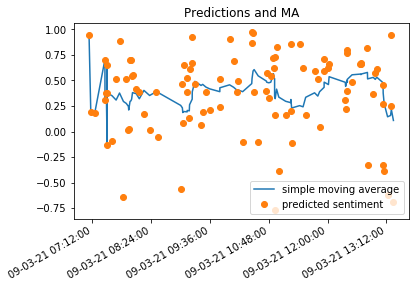
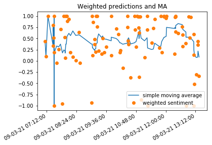
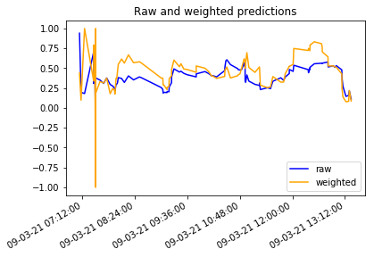

# Machine Learning

Dieses Notebook beinhaltet die Prüfungsleistung für Machine Learning bei Frau Minges. Es wurd erstellt von Patrick Mischka, Jan Grübener, Matthias Vonend, Aaron Schweig, Michael Angermeier und Troy Keßler.

## Inhalt

Ziel ist hier mithilfe von Machine Learning eine Trading Recommendation für Ethereum zu entwickeln. Diese soll aus zwei Teilen bestehen, einmal aus einer technischen Analyse, wo ein LSTM Modell mithilfe historischen Preise und Indikatoren entwickelt und trainiert wird, und einmal aus einer Stimmunsanalyse auf Twitter, wofür ein weiteres Deep Neural Network entwickelt und trainiert wird. Letztendlich sollen die Ergebnisse dieser Modelle Entscheidungshilfen sein, um Ethereum zu handeln.

### 1. Sentimentmodell

Im ersten Teil wird ein Sentimentmodell entwickelt und trainiert, das Ziel ist hier ein Modell zu entwickelt, welches Tweets auf ihre Stimmung bewerten kann.

### 2. Technisches Modell

Im zweiten Teil wird ein technisches Modell entwickelt und trainiert, das Ziel ist hier basieren auf historischen Preisen und anderen technischen Indikatoren zu predicten, ob der Preis am nächsten Tag steigen oder fallen wird.

### 3. Ausführung

Im dritten und letzten Teil werden die Modelle an APIs angeschlossen, sodass die Entscheidungshilfen live ausgeführt werden können.

## Technologien

Für das Modell wird [Tensorflow](https://www.tensorflow.org/) verwendet, zum plotten von Informationen nutzen wir [Matplotlib](https://matplotlib.org/stable/index.html) und zum verarbeiten von Daten [Pandas](https://pandas.pydata.org/). Weiterhin werden weitere utilities von [sklearn](https://scikit-learn.org/stable/) übernommen.

## Setup

Um dieses Notebook zu benutzen müssen Python 3.x und folgende Packages installiert werden:

* tensorflow
* matplotlib
* pandas
* sklearn

Das Datenset fürs trainieren kann über [diesen Link](https://www.dropbox.com/s/ur7pw797mgcc1wr/tweets.csv?dl=0) heruntergeladen werden. Dabei muss die Datei "tweets.csv" in diesen Ordner abgelegt werden.


## 1. Sentimentmodell

In diesem Notebook wird ein Modell trainiert, welches Tweets live auf ihre Stimmung bewerten soll. Dafür wird ein Deep Neural Network erstellt, welches mit 1.6 Millionen Tweets trainiert wird. Hierbei handelt es sich um ein Klassifikationsproblem, es soll letztendlich entschieden werden, ob ein Tweet negativ (0), oder positiv (1) gestimmt ist.

### Datenset

Um nun das Modell möglichst gut darauf zu trainieren reale Tweets zu bewerten haben wir uns für ein Datenset entschieden, welches 1.6 Millionen bereits gelabelte Tweets enthält, dieses kann [hier](https://www.kaggle.com/kazanova/sentiment140) gefunden werden


```python
import matplotlib.pyplot as plt
import os
import re
import shutil
import string
import tensorflow as tf
import pandas as pd

from tensorflow.keras import layers
from tensorflow.keras import losses
from tensorflow.keras import preprocessing
from tensorflow.keras.layers.experimental.preprocessing import TextVectorization
from sklearn.model_selection import train_test_split
from sklearn.utils import shuffle
from tensorflow import feature_column
from tensorflow.keras import layers
```

### Laden des Datensets

Mithilfe von pandas wird das Datenset geladen, dabei werden nur die erste und die letzte Spalte geladen, da nur diese für uns von Interesse sind. Da es sich bei der ersten Spalte um die Stimmung des Tweets handelt wird diese mit "targets" gelabelt, die letzte Spalte beihaltet den eigentlichen Tweet, diese wird mit "text" gelabelt.


```python
dataframe = pd.read_csv("./tweets.csv", usecols=[0, 5], names=["target", "text"])
```

Da das Datenset sortiert ist muss es randomisiert werden. Falls dies nicht gemacht werden würde, hätte dies einen negativen Einfluss auf das Lernen, da alle Daten die zuerst reinkommen negativ gelabelt sind. Somit würde das Modell denken, alles wäre negativ und würde sich entsprechend darauf einstellen, kommen dann letztendlich alle positiven Daten würde das Modell denken es gäbe nur positive Daten und würde letztendlich bei richtigen Daten immer eine positive Stimmung predicten, was nicht der Realtität entsprechen würde.


```python
dataframe = shuffle(dataframe)
```

Zum validieren, dass das Datenset auch korrekt geladen wurde, es sollte eine Tabelle mit den ersten fünf Einträgen zu sehen sein


```python
dataframe.head()
```


<div>
<style scoped>
    .dataframe tbody tr th:only-of-type {
        vertical-align: middle;
    }

    .dataframe tbody tr th {
        vertical-align: top;
    }

    .dataframe thead th {
        text-align: right;
    }
</style>
<table border="1" class="dataframe">
  <thead>
    <tr style="text-align: right;">
      <th></th>
      <th>target</th>
      <th>text</th>
    </tr>
  </thead>
  <tbody>
    <tr>
      <th>84077</th>
      <td>0</td>
      <td>@ElizaPatricia it would but us in the uk don't...</td>
    </tr>
    <tr>
      <th>988991</th>
      <td>4</td>
      <td>Shouts good evening to all. I didn't have a ba...</td>
    </tr>
    <tr>
      <th>1294037</th>
      <td>4</td>
      <td>G'Morning, or is it? Hmmm, Yea it is, even wit...</td>
    </tr>
    <tr>
      <th>1078644</th>
      <td>4</td>
      <td>June, 1st... Here I come!</td>
    </tr>
    <tr>
      <th>773193</th>
      <td>0</td>
      <td>Beanhaus in the AM tomorrow for writing + then...</td>
    </tr>
  </tbody>
</table>
</div>


Um das trainieren des Modells zu überwachen und um die Accuracy des Modells hinterher zu errechnen wird das Datenset in drei Teile unterteilt. In einem Verhältnis von 80:20 wird das Datenset in Trainingsdaten und Testdaten unterteilt. Trainingsdaten dienen hier ausschließlich zum trainieren des Modells, Testdaten werden nach dem Trainieren dazu verwendet, um die Accuracy des Modells zu errechnen, diese sollen reale Daten simulieren. Der Grund, warum das Verhältnis stark auf der Seite der Trainingsdaten liegt, ist, weil mehr Trainingsdaten ein besseres Ergebnis versprechen, dabei muss die Anzahl der Daten bei den Testdaten nicht hoch sein, um die Accuracy zu bestimmen.

Weiterhin werden die Trainingsdaten wiederum in Trainingsdaten und Validationsdaten mit einem Verhältnis von 80:20 unterteilt. Die Validationsdaten werden dazu verwendet um das Training zu überwachen, nach jedem Epoch (Trainingsschritt) wird damit die aktuelle Accuracy bestimmt.


```python
train, test = train_test_split(dataframe, test_size=0.2)
train, val = train_test_split(train, test_size=0.2)

print(len(train), 'training tweets')
print(len(val), 'validation tweets')
print(len(test), 'test tweets')
```

    1024000 training tweets
    256000 validation tweets
    320000 test tweets


Da jetzt das Datenset entsprechend aufgeteilt wurde kann es nun in das verlangte Tensorflowformat gebracht werden. Dafür werden die Features (text) und die Labels (labels) klar definiert. Zusätzlich wird eine Batchsize definiert, welche Daten gruppiert um das Lernen zu beschleunigen.


```python
def df_to_dataset(dataframe, batch_size):
  dataframe = dataframe.copy()
  texts = dataframe.pop('text')
  labels = dataframe.pop('target')
  return tf.data.Dataset.from_tensor_slices((texts, labels)).batch(batch_size)
```


```python
batch_size = 320

raw_train_ds = df_to_dataset(train, batch_size)
raw_val_ds = df_to_dataset(val, batch_size)
raw_test_ds = df_to_dataset(test, batch_size)
```

Um zu validieren, dass die Konvertierung geklappt hat werden die ersten drei Einträge ausgelesen


```python
for text_batch, label_batch in raw_train_ds.take(1):
  for i in range(3):
    print("Tweet:", text_batch.numpy()[i])
    print("Label:", label_batch.numpy()[i])
```

    Tweet: b'first person to buy the jonas brothers cd '
    Label: 4
    Tweet: b'I wish my doggie would come sleep in my bed with me! '
    Label: 0
    Tweet: b'@RiskyBusinessMB Already got mine yesterday!  We love you guys more!!'
    Label: 4


Hier werden die Daten für das Modell normalisiert. Dies ist wichtig um unnötige Duplikate zu vermeiden, wie z.B. Wörter, die in manchen Tweets groß und in anderen wieder klein geschrieben werden. Zusätzlich können Usernames, welche mit "@" beginnen normalisiert werden, da der genaue username unwichtig für die sentiment prediction ist.


```python
def normalize_data(input_data):
  lowercase = tf.strings.lower(input_data)
  return tf.strings.regex_replace(lowercase, '@(\w*)|(\\n)|(https:\/\/t\.co[\w\/]*)', '')
```

Nun können die Texte vektorisiert werden. Da ein neuronales Netz nicht mir Wörtern und Buchstaben arbeiten kann, müssen diese in Zahlen umgewandelt werden. Dafür werden die Tweets in Vektoren umgewandelt. Die Größe des Vektors wird dabei mit sequence_length definiert. Die Größe der sequence_length, also letztendlich die Größe des Vektors sollte in der Regel so groß sein, dass alle Wörter eines Tweets hereinpassen. Da die Anzahl an Zeichen auf 280 pro Tweet limitiert ist, und die durschnittliche Anzahl der Zeichen pro Wort im Englischen bei 5 liegt wird die sequence_length mit 56 definiert.

Hier erhält jedes Wort eine fortlaufende Id, die Reihenfolge wird darüber bestimmt, welche Wörter zuerst vektorisiert werden. Dabei können aufgrund max_features maximal 10000 Wörter eingelesen werden, alle weiteren werden ignoriert, diese Menge an Vokabeln sollte aber ausreichen, da in der Alltagssprache lediglich zwei bis drei tausend Wörter verwendet werden. Somit kann jedes Wort zu einer Id gemappt werden, sodass man letztendlich ganze Sätze in einem Vektor abbilden kann. Damit lösen wir auch das Problem, dass ein neuronales Netz immer die gleiche Inputgröße benötigt, da die Vektorengröße immer der sequence_length enstpricht.

Dafür wird hier ein Vektorlayer erstellt. Gleichzeitig können hier die Daten normalisiert werden.


```python
max_features = 10000
sequence_length = 56

vectorize_layer = TextVectorization(
    standardize=normalize_data,
    max_tokens=max_features,
    output_mode='int',
    output_sequence_length=sequence_length)
```

Hier werden die Trainingsdaten eingelesen, sodass die 10000 features gefüllt werden können, somit haben wir für die Tweets ein eigenes "Wörterbuch"


```python
train_text = raw_train_ds.map(lambda x, y: x)
vectorize_layer.adapt(train_text)
```

Mit der Methode können wir gleich alle Datensets vektorisieren. Hier normalisieren wir noch das Label, sodass das Label eine Range von 0 bis 1, anstatt von 0 bis 4 hat. 


```python
def vectorize_text(text, label):
  text = tf.expand_dims(text, -1)
  return vectorize_layer(text), int(label / 4)
```

Um zu testen, ob das vektorisieren der Tweets funktioniert können wir den ersten Tweet aus dem ersten Batch auslesen und vektorisieren.


```python
text_batch, label_batch = next(iter(raw_train_ds))
text, label = text_batch[0], label_batch[0]
print(text)
print(label)
print(vectorize_text(text, label))
```

    tf.Tensor(b'first person to buy the jonas brothers cd ', shape=(), dtype=string)
    tf.Tensor(4, shape=(), dtype=int64)
    (<tf.Tensor: shape=(1, 56), dtype=int64, numpy=
    array([[ 161,  618,    3,  379,    4,  803, 1062, 1162,    0,    0,    0,
               0,    0,    0,    0,    0,    0,    0,    0,    0,    0,    0,
               0,    0,    0,    0,    0,    0,    0,    0,    0,    0,    0,
               0,    0,    0,    0,    0,    0,    0,    0,    0,    0,    0,
               0,    0,    0,    0,    0,    0,    0,    0,    0,    0,    0,
               0]])>, 1)


Mithilfe des Vektorlayers können wir die Ids wieder zu Wörtern zurückmappen, außerdem können wir die Größe unseres Wörterbuchs auslesen


```python
print("1234 ---> ", vectorize_layer.get_vocabulary()[1234])
print('Vocabulary size: {}'.format(len(vectorize_layer.get_vocabulary())))
```

    1234 --->  comment
    Vocabulary size: 10000


Nun vektorisieren wir alle benötigten Datensets


```python
train_ds = raw_train_ds.map(vectorize_text)
val_ds = raw_val_ds.map(vectorize_text)
test_ds = raw_test_ds.map(vectorize_text)
```

Aus Performancegründen können die Datensets weiter aufbereitet werden. Mit `.cache()` bleiben die Daten im Arbeitsspeicher, nachdem diese von der Festplatte geladen wurden. Somit kann sichergestellt werden, dass das Laden der Daten nicht das Bottleneck beim Training sein wird.

Mit `.prefetch()` können die Daten gleichzeitig mit dem Lernen präprozessiert werden.


```python
AUTOTUNE = tf.data.AUTOTUNE

train_ds = train_ds.cache().prefetch(buffer_size=AUTOTUNE)
val_ds = val_ds.cache().prefetch(buffer_size=AUTOTUNE)
test_ds = test_ds.cache().prefetch(buffer_size=AUTOTUNE)
```

Schließlich definieren wir das eigentliche Modell. Die erste Layer ist ein Embedding-Layer. Dies sorgt dafür, dass jedes Wort wiederum einen eigenen Vektor erhält, dieser stellt die Bedeutung des Wortes dar. Diese Vektoren werden mit dem Modell mit der Zeit trainiert. Diese Embeddinglayer fügt eine weitere Dimension zum Outputvektor hinzu. Hier definieren wir mit der embedding_dim die Größe der Layers, das bedeutet, dass es 32 Nodes pro Layer gibt.

Für die nächste Layer wird `GlobalAveragePooling1D` verwendet. Diese reduziert die Dimension wieder um 1 und verrechnet dabei alle Informationen, sodass nichts verloren geht. Der Outputvektor wird dabei wieder auf eine feste Länge normalisiert.

Anschließend folgt ein fully-connected 32 Dense-Layer. Hier wurde eine Dropoutrate festgelegt, um Overfitting zu verhindern. Das Ziel hier ist random ausgewählte Nodes auf 0 zu setzen, damit das anspassen der Weights der einzelnen Nodes beim lernen gefördert wird.

Letztendlich wird das letzte Layer mit einem Dense Layer zu einer einzigen Node verknüpft. Diese hat eine Range von 0 bis 1 und gibt das Ergenis aus.

Wir können nun noch mit `.summary()` das Modell verifizieren.


```python
embedding_dim = 32

model = tf.keras.Sequential([
  layers.Embedding(max_features + 1, embedding_dim),
  layers.GlobalAveragePooling1D(),
  layers.Dropout(0.2),
  layers.Dense(1)
])

model.summary()
```

    Model: "sequential_1"
    _________________________________________________________________
    Layer (type)                 Output Shape              Param #   
    =================================================================
    embedding_1 (Embedding)      (None, None, 32)          320032    
    _________________________________________________________________
    global_average_pooling1d_1 ( (None, 32)                0         
    _________________________________________________________________
    dropout_1 (Dropout)          (None, 32)                0         
    _________________________________________________________________
    dense_1 (Dense)              (None, 1)                 33        
    =================================================================
    Total params: 320,065
    Trainable params: 320,065
    Non-trainable params: 0
    _________________________________________________________________


Für das Trainieren müssen noch ein paar Parameter definiert werden. Für die Berechnung des Fehlers (loss) verwenden wir die `BinaryCrossentropy` Funktion. Der Fehler gibt uns an, wie weit wir von der richtigen Prediction weg sind. Wir haben uns dafür entschieden, da wir einen sogenannten Binary Classifier haben, der uns eine Wahrscheinlichkeit von 0 bis 1 als Ergebnis gibt. Dabei arbeiten wir mit Logits, sodass die Labels als sogennante Logits betrachtet werden, diese Darstellung als Wahrscheinlichkeit verspricht laut Tensorflow größere numerische Stabilität.

Weiterhin verwenden wir für den Optimierungsalgorithmus den `Adam-Optimizer`. Wir haben uns für den Adam-Optimizer, im Gegensatz zum klassischen Stochastic Gradient Descent Algorithmus entschieden, da sich die Learningrate beim Adam-Optimizer mit der Zeit automatisch anpasst. Das ist besonders praktisch bei Natural Language Processing, da hier die Gradients in der Regel sehr gering sind. Dabei wird die Learningrate basierend auf der vorherigen Änderung der Weights angepasst. Hier haben wir eine sehr kleine Learningrate definiert, da wir ein sehr großes Datenset haben und nicht zu schnell in das Problem von Overfitting laufen wollen, weshalb langsameres lernen, also ein langsameres Anpassen der Weights, hier passender ist.


```python
model.compile(loss=losses.BinaryCrossentropy(from_logits=True),
              optimizer=tf.keras.optimizers.Adam(learning_rate=0.0001),
              metrics=tf.metrics.BinaryAccuracy(threshold=0.0))
```

Nun wird endlich das Modell trainiert. Dafür definieren wir mit epochs, wie oft wir über das Trainingsdatenset iterieren. Es werden in `model.fit()` die Trainingsdaten, die Validationsdaten und die Anzahl der Epochen angegeben. Tensorflow loggt den Fortschritt live in der Konsole aus, zusätzlich wird der Trainingsstatus in einem History-Objekt festgehalten.


```python
epochs = 10
history = model.fit(
    train_ds,
    validation_data=val_ds,
    epochs=epochs)
```

    Epoch 1/10
    3200/3200 [==============================] - 13s 4ms/step - loss: 0.6871 - binary_accuracy: 0.5862 - val_loss: 0.6549 - val_binary_accuracy: 0.6876
    Epoch 2/10
    3200/3200 [==============================] - 11s 3ms/step - loss: 0.6412 - binary_accuracy: 0.6940 - val_loss: 0.6024 - val_binary_accuracy: 0.7168
    Epoch 3/10
    3200/3200 [==============================] - 11s 3ms/step - loss: 0.5919 - binary_accuracy: 0.7222 - val_loss: 0.5633 - val_binary_accuracy: 0.7392
    Epoch 4/10
    3200/3200 [==============================] - 11s 3ms/step - loss: 0.5556 - binary_accuracy: 0.7440 - val_loss: 0.5351 - val_binary_accuracy: 0.7550
    Epoch 5/10
    3200/3200 [==============================] - 11s 3ms/step - loss: 0.5295 - binary_accuracy: 0.7583 - val_loss: 0.5154 - val_binary_accuracy: 0.7659
    Epoch 6/10
    3200/3200 [==============================] - 11s 4ms/step - loss: 0.5111 - binary_accuracy: 0.7679 - val_loss: 0.5021 - val_binary_accuracy: 0.7723
    Epoch 7/10
    3200/3200 [==============================] - 12s 4ms/step - loss: 0.4987 - binary_accuracy: 0.7743 - val_loss: 0.4932 - val_binary_accuracy: 0.7767
    Epoch 8/10
    3200/3200 [==============================] - 12s 4ms/step - loss: 0.4901 - binary_accuracy: 0.7790 - val_loss: 0.4871 - val_binary_accuracy: 0.7799
    Epoch 9/10
    3200/3200 [==============================] - 12s 4ms/step - loss: 0.4843 - binary_accuracy: 0.7825 - val_loss: 0.4828 - val_binary_accuracy: 0.7820
    Epoch 10/10
    3200/3200 [==============================] - 12s 4ms/step - loss: 0.4798 - binary_accuracy: 0.7849 - val_loss: 0.4797 - val_binary_accuracy: 0.7836


Nachdem das Modell nur trainiert ist können wir es mit den vorher festgelegten Testdatensatz testen. Diese sollen wie bereits erwähnt echte Daten simulieren. Dabei erhalten wir mit `model.evaluate()` den Loss und die Accuracy, welche bei rund 80% liegt


```python
loss, accuracy = model.evaluate(test_ds)

print("Loss: ", loss)
print("Accuracy: ", accuracy)
```

    1000/1000 [==============================] - 3s 2ms/step - loss: 0.4796 - binary_accuracy: 0.7842
    Loss:  0.47964781522750854
    Accuracy:  0.7841749787330627


In dem History-Objekt können wir nun sehen, welche Daten Tensorflow für uns aufgezeichnet hat


```python
history_dict = history.history
history_dict.keys()
```


    dict_keys(['loss', 'binary_accuracy', 'val_loss', 'val_binary_accuracy'])


Mithilfe von Matplotlib können wir den Loss plotten und beobachten, wie diese sich beim lernen verhalten hat. Optimalerweise sollte diese mit der Zeit runtergehen, da mit dem Anpassen der Weights das Modell immer genauere Aussagen treffen sollte und somit der Fehler immer geringer wird.

Wir können erkennen, dass dies tatsächlich der Fall ist, dabei fällt der Loss fast exponentiell. Logischerweise wird der Trainingsloss immer geringer, als Bestätigung für die Verbesserung des Modells dient hier die Validationloss. Diese ist fast gleich, sodass wir davon ausgehen können, dass die Anzahl der Fehlinterpretierungen tatsächlich geringer wurde.


```python
loss = history_dict['loss']
val_loss = history_dict['val_loss']

epochs = range(1, len(loss) + 1)

# "bo" is for "blue dot"
plt.plot(epochs, loss, 'o', color='orange', label='Training Loss')
# b is for "solid blue line"
plt.plot(epochs, val_loss, 'blue', label='Validation Loss')
plt.title('Trainings- und Validationsloss')
plt.xlabel('Epochen')
plt.ylabel('Loss')
plt.legend()

plt.show()
```


Das gleiche können wir auch für die Accuracy machen. Hier sollte im Optimalfall die Accuracy mit der Zeit steigen. Dieses Verhalten können wir wieder an unserem Modell erkennen. Hier erinnert der Graph an eine Sättigungskurve. Das liegt daran, dass es mit der Zeit immer schwerer wird das Modell noch mehr zu verbessern, da das Lernen letztendlich eine Optimierung ist, dessen Verbesserung im späteren Verlauf nur mit höheren Aufwänden zu erreichen ist.

An beiden Graphiken kann man jedoch gut erkennen, dass es zu keinem Overfitting kommt. Wenn wir die Accuracy betrachten, würde bei Overfitting die Accuracy der Testdaten weiter Ansteigen, während die Accuracy der Validationsdaten und die der Testdaten stagniert oder gar heruntergeht. Das gleiche würde analog mit dem Loss passieren.


```python
acc = history_dict['binary_accuracy']
val_acc = history_dict['val_binary_accuracy']

plt.plot(epochs, acc, 'o', color='orange', label='Training Accuracy')
plt.plot(epochs, val_acc, 'blue', label='Validation Accuracy')
plt.title('Trainings- und Validationsaccuracy')
plt.xlabel('Epochen')
plt.ylabel('Accuracy')
plt.legend(loc='lower right')

plt.show()
```


Nun exportieren wir das fertige Modell. Da wir vorher die Texte vektorisiert haben, bevor sie in das Modell gegeben wurden, können wir hier ein Modell exportieren, welche die Texte beim Input vektorisiert. Dies macht uns jetzt das zukünftige Predicten einfacher. Zusätzlich fügen wir am Ende eine weitere Node mit einer Sigmoid Aktivierungsfunktion hinzu. Diese mappt uns alle Werte zwischen 0 und 1, sodass unsere definiert Sentiment Range eingehalten wird. Die Vektorisationlayer und die Sigmoid Node wurden beim lernen weggelassen, um die Effizienz zu erhöhen.


```python
sentiment_model = tf.keras.Sequential([
  vectorize_layer,
  model,
  layers.Activation('sigmoid')
])
```

Schließlich können wir ein paar Beispiele eingeben um zu sehen, was das Modell denkt. Dabei ist der erste Satz positiv, der zweite neutral und der letzte negativ. Anhand der Ergebnisse können wir sehen, dass das Modell ähnlich darüber denkt. Während der neutrale Satz mit rund 0.5 gewertet wird, wird der positive höher gewertet und der negative geringer.


```python
examples = [
  "Today is a great day!",
  "This sentence is rather neutral",
  "This show is terrible!"
]

sentiment_model.predict(examples)
```


    array([[0.83909595],
           [0.52048975],
           [0.4144154 ]], dtype=float32)


## 2. Technisches Modell


```python
# technical analysis
```

## 3. Auführung

## Anwenden auf Twitter Livedaten

Da die Sentimentanalyse lediglich eine Ergänzung zu der technischen Analyse ist müssen die Ergebnisse entsprechend aufbereitet werden.

Um die Tweets zu fetchen wird `searchtweets` verwendet. Weiterhin wird wieder Matplotlib verwendet, um die Ergebnisse graphisch darzustellen.


```python
# pip install searchtweets-v2
from searchtweets import load_credentials, gen_request_parameters, collect_results
import numpy as np
from datetime import datetime
import matplotlib.dates as mdate
import math
```

Hier laden wir den Token für die Twitter API, dieser sollte sich im Rootordner des Projekts liegen.


```python
search_args = load_credentials("./.twitter_keys.yaml", yaml_key="search_tweets_v2")
```

Hier definieren wir unsere Queryparameter. Wir laden 100 Tweets, was das Maximum für einen einzelnen API Request ist und geben an, dass alle Tweets mit den Keywords "ether", "eth", "ethereum" oder "cryptocurrency" gefetcht werden sollen. Weiterhin filtern wir Tweets von Bots heraus und Tweets, die das Wort "app" enthalten, da dies meist nur Werbung ist. Zusätzlich müssen die Nutzer verifiziert sein und die Sprache englisch.


```python
max_tweets = 100

query = gen_request_parameters(
    "(ether OR eth OR ethereum OR cryptocurrency) -bot -app -is:retweet is:verified lang:en",
    tweet_fields="id,created_at,text,public_metrics",
    results_per_call=max_tweets)
```

Mit `collect_results()` fetchen wir nun die Tweets und reversen sie, da sie hier für uns falschrum ankommen (neuester Tweet kommt hier zuerst). Mit `pop()` entfernen wir das erste Element, da es sich hier um ein Informationsobjekt handelt. Weiterhin filtern wir die für uns relevanten Informationen heraus wie Datum und Text.


```python
tweets = list(reversed(collect_results(query, max_tweets=max_tweets, result_stream_args=search_args)))

tweets.pop(0)

print(tweets[0])

create_dates = []
tweet_texts = []

for tweet in tweets:
    if 'text' not in tweet:
        continue
    tweet_texts.append(tweet['text'])
    
    utc_time = datetime.strptime(tweet['created_at'], "%Y-%m-%dT%H:%M:%S.%fZ")
    epoch_time = (utc_time - datetime(1970, 1, 1)).total_seconds()
    create_dates.append(epoch_time)
```

    {'created_at': '2021-03-09T07:07:53.000Z', 'text': '@eth_classc If you have account specific question please  submit your inquiry via our Support page (https://t.co/ibIfj6pVrg), so we can locate your account and give you a detailed and tailored answer. ^IP', 'id': '1369183141911539712', 'public_metrics': {'retweet_count': 0, 'reply_count': 0, 'like_count': 0, 'quote_count': 0}}


Hier übergeben wir unseren Sentimentmodel den Batch an gefetchten Tweets. Dannach formatieren wir noch das Sentiment, sodass es von -1 bis 1 geht. Somit kann man besser unterscheiden, ob Tweets negativ oder positiv gemeint sind.


```python
raw_sentiment = sentiment_model.predict(tweet_texts).flatten()

sentiment = []

for s in raw_sentiment:
    sentiment.append((s - 0.5) * 2)

for i in range(5):
    d = create_dates[i]
    t = tweet_texts[i]
    p = sentiment[i]
    print("{} - {} - {}".format(d,t,p))
```

    1615273673.0 - @eth_classc If you have account specific question please  submit your inquiry via our Support page (https://t.co/ibIfj6pVrg), so we can locate your account and give you a detailed and tailored answer. ^IP - 0.9402775764465332
    1615273800.0 - @PayPal is going into the cryptocurrency biz. 
    
    https://t.co/fn3jn0xtZG - 0.19592392444610596
    1615274090.0 - becoming a dark sun defiler irl to harvest cryptocurrency https://t.co/ENICTTGJga - 0.18068480491638184
    1615274839.0 - PayPal will acquire the #cryptocurrency firm Curv as it seeks to beef up its talent pool for handling digital currencies https://t.co/Tx9ij346aQ $PYPL
    
    More on @crypto: https://t.co/xsy3kMSJsZ https://t.co/M1qocs08cp - 0.7037849426269531
    1615274844.0 - Who has the most to gain from the environmentally based attacks on cryptocurrency? - 0.30715858936309814


Da wir den aktuellen Sentimenttrend bestimmen wollen implementieren wir eine Simple Moving Average


```python
def simple_moving_avg(x, n):
    cumsum = np.cumsum(np.insert(x, 0, 0))
    return (cumsum[n:] - cumsum[:-n]) / float(n)
```

Nun plotten wir das Sentiment in einen Zeitgraphen. Hier können wir bereits erkennen, wir die aktuelle Marktstimmung der letzten Stunden aussieht


```python
n = 10
sma = simple_moving_avg(sentiment, n)

for i in range(n - 1):
    sma = np.insert(sma, i, sentiment[i])
    
dates = mdate.epoch2num(create_dates)

fig, ax = plt.subplots()

ax.plot(dates, sma, label="simple moving average")
ax.plot(dates, sentiment, "o", label="predicted sentiment")

date_fmt = '%d-%m-%y %H:%M:%S'

date_formatter = mdate.DateFormatter(date_fmt)
ax.xaxis.set_major_formatter(date_formatter)

fig.autofmt_xdate()

plt.title('Predictions and MA')
plt.legend(loc='lower right')

plt.show()
```





Wir wollen aber zusätzlich noch den Einfluss der Tweets miteinberechnen. Dafür gewichten wir die Tweets mithilfe der Anzahl der Likes. Dafür mulitplizieren wir die Anzahl der Likes mit dem Sentiment Wert (+1 da sonst alle Tweets mit 0 Likes eliminiert werden). Mit den Sigmoid Funktion squashen wir alle Werte zurück in unseren vorherigen Wertebereich.


```python
weighted_sentiment = []

def normalized_sigmoid(x):
  return ((1 / (1 + math.exp(-x))) - 0.5) * 2

for i in range(len(sentiment)):
    weight = tweets[i]['public_metrics']['like_count'] + 1
    weighted_sentiment.append(normalized_sigmoid(weight * sentiment[i]))

```

Nun können wir die gewichtete Marktstimmung erneut ausgeben


```python
n = 10
weighted_sma = simple_moving_avg(weighted_sentiment, n)

for i in range(n - 1):
    weighted_sma = np.insert(weighted_sma, i, weighted_sentiment[i])
    
dates = mdate.epoch2num(create_dates)

fig, ax = plt.subplots()

ax.plot(dates, weighted_sma, label="simple moving average")
ax.plot(dates, weighted_sentiment, "o", label="weighted sentiment")

date_fmt = '%d-%m-%y %H:%M:%S'

date_formatter = mdate.DateFormatter(date_fmt)
ax.xaxis.set_major_formatter(date_formatter)

fig.autofmt_xdate()

plt.title('Weighted predictions and MA')
plt.legend(loc='lower right')

plt.show()
```





Letztendlich können wir die beiden Werte noch vergleichen, um zu überprüfen, ob die Gewichtung tatsächlich einen Einfluss auf den Stimmungstrend hat


```python
dates = mdate.epoch2num(create_dates)

fig, ax = plt.subplots()

ax.plot(dates, sma, label="raw", color='blue')
ax.plot(dates, weighted_sma, label="weighted", color='orange')

date_fmt = '%d-%m-%y %H:%M:%S'

date_formatter = mdate.DateFormatter(date_fmt)
ax.xaxis.set_major_formatter(date_formatter)

fig.autofmt_xdate()

plt.title('Raw and weighted predictions')
plt.legend(loc='lower right')

plt.show()
```




