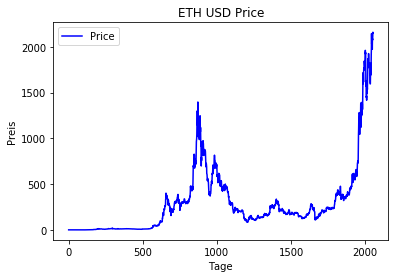
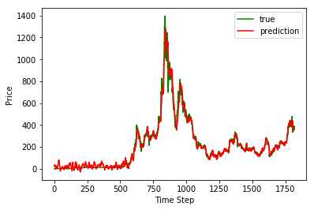

@patrick

# Machine Learning

Dieses Notebook beinhaltet die Prüfungsleistung im Kurs WWI18SEA/C für Machine Learning bei Frau Minges. Es wurde erstellt von Patrick Mischka, Jan Grübener, Matthias Vonend, Aaron Schweig, Michael Angermeier und Troy Keßler.

Hinweis: Alle Sektionen, welche mit @ annotiert sind, sind lediglich Einteilungen für die Präsentation und stellen nicht die Leistung der Personen dar.

## Inhalt

Ziel ist mithilfe von Machine Learning eine Trading Recommendation für Ethereum zu entwickeln. Diese soll aus zwei Teilen bestehen, zum einen aus einer technischen Analyse, wo ein LSTM Modell unter Verwendung von historischen Preisen und Indikatoren entwickelt und trainiert wird, und zum Anderen aus einer Stimmungsanalyse auf Twitter, wofür ein weiteres Deep Neural Network entwickelt und trainiert wird. Letztendlich sollen die Ergebnisse dieser Modelle Entscheidungshilfen sein, um Ethereum zu handeln.

### 1. Sentimentmodell

Im ersten Teil wird ein Sentimentmodell entwickelt und trainiert. Das Ziel ist hier ein Modell zu entwickelt, welches Tweets auf ihre Stimmung bewerten kann.

### 2. Technisches Modell

Im zweiten Teil wird ein technisches Modell entwickelt und trainiert. Das Ziel ist hier, basierend auf historischen Preisverläufen und anderen technischen Indikatoren, den zukünftigen Preis für die nächsten 30 Tage vorherzusagen.

### 3. Ausführung

Im dritten und letzten Teil werden die Modelle an APIs angeschlossen, so dass die Entscheidungshilfen live ausgeführt werden können.

## Technologien

Für das Modell wird [Tensorflow](https://www.tensorflow.org/) verwendet, zum Plotten von Informationen nutzen wir [Matplotlib](https://matplotlib.org/stable/index.html) und zum Verarbeiten von Daten [Pandas](https://pandas.pydata.org/). Außerdem werden weitere Utilities von [sklearn](https://scikit-learn.org/stable/) übernommen.

## Setup

Um dieses Notebook zu benutzen müssen Python 3.x (vorzugsweise 3.7.3) und folgende Packages installiert werden:

* tensorflow==2.4.1
* matplotlib==3.0.3
* pandas==1.2.2
* pandas_datareader==0.9.0
* searchtweets-v2==1.0.7
* sklearn

Das Datenset für das Trainieren kann über [diesen Link](https://www.dropbox.com/s/ur7pw797mgcc1wr/tweets.csv?dl=0) heruntergeladen werden. Dabei muss die Datei "tweets.csv" in den gleichen Ordner wie dieses Notepad abgelegt werden.


## 1. Sentimentmodell

In diesem Notebook wird ein Modell trainiert, welches Tweets live auf ihre Stimmung bewerten soll. Dafür wird ein Deep Neural Network erstellt, welches mit 1.6 Millionen Tweets trainiert wird. Hierbei handelt es sich um ein Klassifikationsproblem, es soll letztendlich entschieden werden, ob ein Tweet negativ (0), oder positiv (1) gestimmt ist.

### Datensatz

Um nun das Modell möglichst gut darauf zu trainieren reale Tweets zu bewerten haben wir uns für ein Datenset entschieden, welches 1.6 Millionen bereits gelabelte Tweets enthält. Dieses Datenset kann [hier](https://www.kaggle.com/kazanova/sentiment140) gefunden werden.


```python
import matplotlib.pyplot as plt
import os
import re
import shutil
import string
import tensorflow as tf
import pandas as pd

from tensorflow.keras import layers
from tensorflow.keras import losses
from tensorflow.keras import preprocessing
from tensorflow.keras.layers.experimental.preprocessing import TextVectorization
from sklearn.model_selection import train_test_split
from sklearn.utils import shuffle
from tensorflow import feature_column
```

### Laden des Datensatzes

Mithilfe von pandas wird das Datenset geladen. Dabei werden nur die erste und die letzte Spalte geladen, da nur diese für uns von Interesse sind. Da es sich bei der ersten Spalte um die Stimmung des Tweets handelt, wird diese mit "targets" gelabelt. Die letzte Spalte beinhaltet den eigentlichen Tweet, welcher mit "text" gelabelt wird.


```python
dataframe = pd.read_csv("./tweets.csv", usecols=[0, 5], names=["target", "text"])
```

Da das Datenset sortiert ist, muss es randomisiert werden. Falls dies nicht gemacht werden würde, hätte dies einen negativen Einfluss auf das Lernen. Zuerst würden alle negativ gelabelten Daten geladen werden, wodurch das Modell "denkt", dass alle Daten negativ wären. Das Modell würde sich entsprechend darauf einstellen. Werden positiven Daten verwerdet, würde das Modell annehmen, dass es nur positive Daten gäbe. Dementsprechend würde es bei richtigen (nicht-trainings) Daten immer eine positive Stimmung vorhersagen, was aber nicht der Realtität entsprechen würde.


```python
dataframe = shuffle(dataframe)
```

Wenn der Datensatz korrekt geladen wurde sollte eine Tabelle mit den ersten fünf Einträgen zu sehen sein.


```python
dataframe.head()
```


<div>
<style scoped>
    .dataframe tbody tr th:only-of-type {
        vertical-align: middle;
    }

    .dataframe tbody tr th {
        vertical-align: top;
    }

    .dataframe thead th {
        text-align: right;
    }
</style>
<table border="1" class="dataframe">
  <thead>
    <tr style="text-align: right;">
      <th></th>
      <th>target</th>
      <th>text</th>
    </tr>
  </thead>
  <tbody>
    <tr>
      <th>279758</th>
      <td>0</td>
      <td>@rocsidiaz me too  I can't believe what happened.</td>
    </tr>
    <tr>
      <th>1320597</th>
      <td>4</td>
      <td>@deelectable  I'm sorry to hear that Dee,keep ...</td>
    </tr>
    <tr>
      <th>634510</th>
      <td>0</td>
      <td>Its boring home alone when ur sik and nothing ...</td>
    </tr>
    <tr>
      <th>370976</th>
      <td>0</td>
      <td>Settling down in Manila</td>
    </tr>
    <tr>
      <th>977684</th>
      <td>4</td>
      <td>@JonasBrothers you new album cover &amp;quot;Lines...</td>
    </tr>
  </tbody>
</table>
</div>


Um das Trainieren des Modells zu überwachen und um die Trefferquote des Modells hinterher zu errechnen wird der Datensatz in drei Teile unterteilt. In einem Verhältnis von 80:20 wird der Datensatz in Trainingsdaten und Testdaten unterteilt. Trainingsdaten dienen hier ausschließlich zum Trainieren des Modells. Die Testdaten werden nach dem Trainieren dazu verwendet, um die Trefferquote des Modells zu errechnen. Diese sollen reale Daten simulieren. Dieses Verhältnis wurde gewählt, da mehr Trainingsdaten ein besseres Ergebnis versprechen. Die Anzahl der Testdaten muss hingegen nicht hoch sein, um die Trefferquote zu bestimmen.

Weiterhin werden die Trainingsdaten wiederum in Trainingsdaten und Validierungsdaten aufgeteilt. Auch hier wird ein Verhältnis von 80:20 angesetzt. Die Validierungsdaten werden dazu verwendet, um das Training zu überwachen. Nach jeder Epoche (Trainingsschritt) wird damit die aktuelle Trefferquote bestimmt.


```python
train, test = train_test_split(dataframe, test_size=0.2)
train, val = train_test_split(train, test_size=0.2)

print(len(train), 'training tweets')
print(len(val), 'validation tweets')
print(len(test), 'test tweets')
```

    1024000 training tweets
    256000 validation tweets
    320000 test tweets
    

Da jetzt der Datensatz entsprechend aufgeteilt wurde, kann er nun in das Tensorflow-Format gebracht werden. Dafür werden die Features (text) und die Labels (labels) klar definiert. Zusätzlich wird eine Batchgröße definiert, welche Daten gruppiert und dadurch das Lernen beschleunigt.


```python
def df_to_dataset(dataframe, batch_size):
  dataframe = dataframe.copy()
  texts = dataframe.pop('text')
  labels = dataframe.pop('target')
  return tf.data.Dataset.from_tensor_slices((texts, labels)).batch(batch_size)
```


```python
batch_size = 320

raw_train_ds = df_to_dataset(train, batch_size)
raw_val_ds = df_to_dataset(val, batch_size)
raw_test_ds = df_to_dataset(test, batch_size)
```

Um zu validieren, dass die Konvertierung erfolgreich war, werden die ersten drei Einträge ausgelesen.


```python
for text_batch, label_batch in raw_train_ds.take(1):
  for i in range(3):
    print("Tweet:", text_batch.numpy()[i])
    print("Label:", label_batch.numpy()[i])
```

    Tweet: b'Rather tired. But, the morning shows promise with the rising sun.  #fb'
    Label: 4
    Tweet: b"g'morning!! twittersss!!!  wake up!!!"
    Label: 4
    Tweet: b'my favourite patient died today, what a downer '
    Label: 0
    

@matthias

Um unnötige Duplikate zu vermeiden, werden die Daten für das Modell normalisiert. Beispielsweiße werden Wörter, die in manchen Tweets groß und in anderen wieder klein geschrieben werden, angepasst. Zusätzlich können User-Namen, welche mit "@" beginnen normalisiert werden, da der genaue User-Name unwichtig für die Sentiment-prediction ist.


```python
def normalize_data(input_data):
  lowercase = tf.strings.lower(input_data)
  return tf.strings.regex_replace(lowercase, '@(\w*)|(\\n)|(https:\/\/t\.co[\w\/]*)', '')
```

Nun können die Texte vektorisiert werden. Da ein neuronales Netz nicht mit Wörtern und Buchstaben arbeiten kann, müssen diese in Zahlen umgewandelt werden. Dafür werden die Tweets in Vektoren umgewandelt. Die Größe des Vektors wird dabei mit sequence_length definiert. Die Größe der sequence_length, also die Größe des Vektors, sollte in der Regel so groß sein, dass alle Wörter eines Tweets hineinpassen. Da die Anzahl an Zeichen auf 280 pro Tweet limitiert ist, und die durchnittliche Anzahl der Zeichen pro Wort im Englischen bei 5 liegt, wird die sequence_length mit 56 definiert.

Hier erhält jedes Wort eine fortlaufende Id. Die Reihenfolge dieser Ids ist durch die Reihenfolge in dem die Wörter vektorisiert wurden festgelegt. Dabei können aufgrund max_features maximal 10000 Wörter eingelesen werden. Alle weiteren Wörter werden ignoriert. Diese Menge an Vokabeln sollte aber ausreichen, da in der Alltagssprache lediglich zwei- bis dreitausend Wörter verwendet werden. Somit kann jedes Wort einer Id zugewiesen werden, sodass man ganze Sätze in einem Vektor abbilden kann. Da die Vektorengröße immer der sequence_length enstpricht, wird auch das Problem, dass ein neuronales Netz immer die gleiche Inputgröße benötigt, gelöst.

Dafür wird hier ein Vektorlayer erstellt. Gleichzeitig können hier die Daten normalisiert werden.


```python
max_features = 10000
sequence_length = 56

vectorize_layer = TextVectorization(
    standardize=normalize_data,
    max_tokens=max_features,
    output_mode='int',
    output_sequence_length=sequence_length)
```

Hier werden die Trainingsdaten eingelesen, so dass die 10000 Features gefüllt werden können. Es entsteht ein "Wörterbuch" für Tweets


```python
train_text = raw_train_ds.map(lambda x, y: x)
vectorize_layer.adapt(train_text)
```

Mit der Methode können wir alle Datensätze vektorisieren. Hier normalisieren wir das Label, so dass das Label eine Wertebereich von 0 bis 1, anstatt von 0 bis 4 besitzt. 


```python
def vectorize_text(text, label):
  text = tf.expand_dims(text, -1)
  return vectorize_layer(text), int(label / 4)
```

Um zu testen, ob das Vektorisieren der Tweets funktioniert, können wir den ersten Tweet aus dem ersten Batch auslesen und vektorisieren.


```python
text_batch, label_batch = next(iter(raw_train_ds))
text, label = text_batch[0], label_batch[0]
print(text)
print(label)
print(vectorize_text(text, label))
```

    tf.Tensor(b'Rather tired. But, the morning shows promise with the rising sun.  #fb', shape=(), dtype=string)
    tf.Tensor(4, shape=(), dtype=int64)
    (<tf.Tensor: shape=(1, 56), dtype=int64, numpy=
    array([[ 742,  825, 1452,    4,  121,  984, 1830,   22,    4, 9892, 3185,
            1068,    0,    0,    0,    0,    0,    0,    0,    0,    0,    0,
               0,    0,    0,    0,    0,    0,    0,    0,    0,    0,    0,
               0,    0,    0,    0,    0,    0,    0,    0,    0,    0,    0,
               0,    0,    0,    0,    0,    0,    0,    0,    0,    0,    0,
               0]], dtype=int64)>, 1)
    

Mithilfe des Vektorlayers können wir von den Ids wieder auf die Wörtern zurückschließen. Außerdem können wir die Größe unseres Wörterbuchs auslesen.


```python
print("1234 ---> ", vectorize_layer.get_vocabulary()[1234])
print('Vocabulary size: {}'.format(len(vectorize_layer.get_vocabulary())))
```

    1234 --->  middle
    Vocabulary size: 10000
    

Nun vektorisieren wir alle benötigten Datensätze.


```python
train_ds = raw_train_ds.map(vectorize_text)
val_ds = raw_val_ds.map(vectorize_text)
test_ds = raw_test_ds.map(vectorize_text)
```

Aus Performancegründen können die Datensätze weiter aufbereitet werden. Mit `.cache()` bleiben die Daten im Arbeitsspeicher, nachdem diese von der Festplatte geladen wurden. Somit kann sichergestellt werden, dass das Laden der Daten nicht der Flaschenhals beim Training sein wird.

Mit `.prefetch()` können die Daten gleichzeitig mit dem Lernen präprozessiert werden.


```python
AUTOTUNE = tf.data.AUTOTUNE

train_ds = train_ds.cache().prefetch(buffer_size=AUTOTUNE)
val_ds = val_ds.cache().prefetch(buffer_size=AUTOTUNE)
test_ds = test_ds.cache().prefetch(buffer_size=AUTOTUNE)
```

@troy

Schließlich definieren wir das eigentliche Modell. Der erste Layer ist ein Embedding-Layer. Dieser sorgt dafür, dass jedes Wort einen eigenen Vektor erhält, welcher die Bedeutung des Wortes darstellt. Diese Vektoren werden mit dem Modell über die Zeit trainiert. Dieser Embedding-Layer fügt eine weitere Dimension zum Outputvektor hinzu. Hier definieren wir mit der embedding_dim die Größe der Layer, das bedeutet, dass es 32 Nodes pro Layer gibt.

Als nächster Layer wird `GlobalAveragePooling1D` verwendet. Dieser reduziert die Dimension wieder um 1 und verrechnet dabei alle Informationen, sodass keine Informationen verloren gehen. Der Outputvektor wird dabei wieder auf eine feste Länge normalisiert.

Anschließend folgt ein fully-connected 32 Dense-Layer. Hier wurde eine Dropoutrate festgelegt, um Overfitting zu verhindern. Das Ziel hier ist random ausgewählte Nodes auf 0 zu setzen, damit das anspassen der Weights der einzelnen Nodes beim Lernen gefördert wird.

Letztendlich wird der letzte Layer mit einem Dense Layer zu einer einzigen Node verknüpft. Diese hat eine Range von 0 bis 1 und gibt das Ergenis aus.

Wir können nun noch mit `.summary()` das Modell verifizieren.


```python
embedding_dim = 32

model = tf.keras.Sequential([
  layers.Embedding(max_features + 1, embedding_dim),
  layers.GlobalAveragePooling1D(),
  layers.Dropout(0.2),
  layers.Dense(1)
])

model.summary()
```

    Model: "sequential"
    _________________________________________________________________
    Layer (type)                 Output Shape              Param #   
    =================================================================
    embedding (Embedding)        (None, None, 32)          320032    
    _________________________________________________________________
    global_average_pooling1d (Gl (None, 32)                0         
    _________________________________________________________________
    dropout (Dropout)            (None, 32)                0         
    _________________________________________________________________
    dense (Dense)                (None, 1)                 33        
    =================================================================
    Total params: 320,065
    Trainable params: 320,065
    Non-trainable params: 0
    _________________________________________________________________
    

Für das Trainieren müssen noch ein paar Parameter definiert werden. Für die Berechnung des Fehlers (loss) verwenden wir die `BinaryCrossentropy` Funktion. Der Fehler gibt uns an, wie weit wir von der richtigen Prediction weg sind. Wir haben uns dafür entschieden, da wir einen sogenannten Binary Classifier haben, der uns eine Wahrscheinlichkeit von 0 bis 1 als Ergebnis gibt. Dabei arbeiten wir mit Logits, sodass die Labels als sogennante Logits betrachtet werden. Diese Darstellung als Wahrscheinlichkeit verspricht laut Tensorflow größere numerische Stabilität.

Weiterhin verwenden wir für den Optimierungsalgorithmus den `Adam-Optimizer`. Wir haben uns für den Adam-Optimizer, im Vergleich zum klassischen Stochastic-Gradient-Descent-Algorithmus entschieden, da sich die Learningrate beim Adam-Optimizer mit der Zeit automatisch anpasst. Das ist besonders praktisch bei Natural-Language-Processing, da hier die Gradients in der Regel sehr gering sind. Dabei wird die Learningrate basierend auf der vorherigen Änderung der Weights angepasst. Hier haben wir eine sehr kleine Learningrate definiert, da wir ein sehr großes Datenset haben und nicht zu schnell in das Problem von Overfitting laufen wollen.


```python
model.compile(loss=losses.BinaryCrossentropy(from_logits=True),
              optimizer=tf.keras.optimizers.Adam(learning_rate=0.0001),
              metrics=tf.metrics.BinaryAccuracy(threshold=0.0))
```

Nun wird das Modell trainiert. Dafür definieren wir mit epochs, wie oft wir über das Trainingsdatenset iterieren. In `model.fit()` werden die Trainingsdaten, die Validationsdaten und die Anzahl der Epochen angegeben. Tensorflow loggt den Fortschritt live in der Konsole aus und zusätzlich wird der Trainingsstatus in einem History-Objekt festgehalten.


```python
epochs = 10
history = model.fit(
    train_ds,
    validation_data=val_ds,
    epochs=epochs)
```

    Epoch 1/10
    3200/3200 [==============================] - 22s 7ms/step - loss: 0.6862 - binary_accuracy: 0.5982 - val_loss: 0.6522 - val_binary_accuracy: 0.6898
    Epoch 2/10
    3200/3200 [==============================] - 19s 6ms/step - loss: 0.6385 - binary_accuracy: 0.6971 - val_loss: 0.5999 - val_binary_accuracy: 0.7179
    Epoch 3/10
    3200/3200 [==============================] - 19s 6ms/step - loss: 0.5894 - binary_accuracy: 0.7242 - val_loss: 0.5612 - val_binary_accuracy: 0.7406
    Epoch 4/10
    3200/3200 [==============================] - 19s 6ms/step - loss: 0.5536 - binary_accuracy: 0.7451 - val_loss: 0.5333 - val_binary_accuracy: 0.7555
    Epoch 5/10
    3200/3200 [==============================] - 19s 6ms/step - loss: 0.5279 - binary_accuracy: 0.7596 - val_loss: 0.5138 - val_binary_accuracy: 0.7662
    Epoch 6/10
    3200/3200 [==============================] - 19s 6ms/step - loss: 0.5100 - binary_accuracy: 0.7689 - val_loss: 0.5006 - val_binary_accuracy: 0.7726
    Epoch 7/10
    3200/3200 [==============================] - 20s 6ms/step - loss: 0.4978 - binary_accuracy: 0.7751 - val_loss: 0.4917 - val_binary_accuracy: 0.7766
    Epoch 8/10
    3200/3200 [==============================] - 20s 6ms/step - loss: 0.4895 - binary_accuracy: 0.7796 - val_loss: 0.4857 - val_binary_accuracy: 0.7799
    Epoch 9/10
    3200/3200 [==============================] - 19s 6ms/step - loss: 0.4836 - binary_accuracy: 0.7827 - val_loss: 0.4814 - val_binary_accuracy: 0.7827
    Epoch 10/10
    3200/3200 [==============================] - 19s 6ms/step - loss: 0.4794 - binary_accuracy: 0.7849 - val_loss: 0.4783 - val_binary_accuracy: 0.7843
    

Nachdem das Modell nur trainiert ist können wir es mit den vorher festgelegten Testdatensatz testen. Diese sollen wie bereits erwähnt echte Daten simulieren. Dabei erhalten wir mit `model.evaluate()` den Loss und die Accuracy, welche bei rund 80% liegt.


```python
loss, accuracy = model.evaluate(test_ds)

print("Loss: ", loss)
print("Accuracy: ", accuracy)
```

    1000/1000 [==============================] - 3s 3ms/step - loss: 0.4788 - binary_accuracy: 0.7841
    Loss:  0.4788129925727844
    Accuracy:  0.7840874791145325
    

In dem History-Objekt können wir nun sehen, welche Daten Tensorflow für uns aufgezeichnet hat.


```python
history_dict = history.history
history_dict.keys()
```


    dict_keys(['loss', 'binary_accuracy', 'val_loss', 'val_binary_accuracy'])


Mithilfe von Matplotlib können wir den Loss plotten und beobachten, wie sich diese während des Lernens verhalten hat. Optimalerweise sollte diese mit der Zeit sinken, da mit dem Anpassen der Weights das Modell immer genauere Aussagen treffen sollte und somit auch der Fehler immer geringer werden sollte.

Wir können erkennen, dass dies tatsächlich der Fall ist. Der Loss fällt fast exponentiell. Logischerweise wird der Trainingsloss immer geringer. Als Bestätigung für die Verbesserung des Modells dient hier der Validationloss. Dieser ist fast gleich, sodass wir davon ausgehen können, dass die Anzahl der Fehlinterpretierungen tatsächlich geringer wurde.


```python
loss = history_dict['loss']
val_loss = history_dict['val_loss']

epochs = range(1, len(loss) + 1)

# "bo" is for "blue dot"
plt.plot(epochs, loss, 'o', color='orange', label='Training Loss')
# b is for "solid blue line"
plt.plot(epochs, val_loss, 'blue', label='Validation Loss')
plt.title('Trainings- und Validationsloss')
plt.xlabel('Epochen')
plt.ylabel('Loss')
plt.legend()

plt.show()
```


    

    


Das Gleiche können wir auch für die Accuracy durchführen. Hier sollte im Optimalfall die Accuracy mit der Zeit steigen. Dieses Verhalten können wir wieder an unserem Modell erkennen. Hier erinnert der Graph an eine Sättigungskurve. Dies liegt daran, dass das Lernen letztendlich eine Optimierung ist und es mit der Zeit immer schwerer wird, das Modell noch mehr zu verbessern.

An beiden Graphiken kann man jedoch gut erkennen, dass es zu keinem Overfitting kommt. Wenn wir die Accuracy betrachten, würde bei Overfitting die Accuracy der Testdaten weiter ansteigen, während die Accuracy der Validationsdaten und die der Testdaten stagniert oder gar sinken. Das Gleiche würde analog mit dem Loss passieren.


```python
acc = history_dict['binary_accuracy']
val_acc = history_dict['val_binary_accuracy']

plt.plot(epochs, acc, 'o', color='orange', label='Training Accuracy')
plt.plot(epochs, val_acc, 'blue', label='Validation Accuracy')
plt.title('Trainings- und Validationsaccuracy')
plt.xlabel('Epochen')
plt.ylabel('Accuracy')
plt.legend(loc='lower right')

plt.show()
```


    

    


Nun exportieren wir das fertige Modell. Da wir vorher die Texte vektorisiert haben, bevor sie in das Modell gegeben wurden, können wir hier ein Modell exportieren, welche die Texte beim Input vektorisiert. Dies macht uns das zukünftige Predicten einfacher, da das Model nicht immer neu trainiert werden muss. Zusätzlich fügen wir am Ende eine weitere Node mit einer Sigmoid Aktivierungsfunktion hinzu. Diese bildet alle Werte auf Werte zwischen 0 und 1 ab, sodass unsere definiert Sentiment-Range eingehalten wird. Der Vektorisationlayer und die Sigmoid Node wurden beim Lernen vernachlässigt, damit die Lerneffizienz höher ausfällt.


```python
sentiment_model = tf.keras.Sequential([
  vectorize_layer,
  model,
  layers.Activation('sigmoid')
])
```

Schließlich können wir einige Beispiele eingeben, um zu sehen, wie sich das Modell verhält. Dabei ist der erste Satz positiv, der zweite neutral und der letzte negativ. Während der neutrale Satz mit rund 0.5 gewertet wird, wird der positive höher gewertet und der negative geringer.


```python
examples = [
  "Today is a great day!",
  "This sentence is rather neutral",
  "This show is terrible!"
]

sentiment_model.predict(examples)
```


    array([[0.8559035 ],
           [0.53341323],
           [0.44238377]], dtype=float32)


@jan

## 2. Technisches Modell

Bei dem zweiten Modell soll mithilfe von Finanzdaten eine Progrose erstellt werden, wie der Kursverlauf in den nächsten 30 Tagen sein wird. Für diese Progrose wird ein LSTM-Modell verwendet. Die Prognose wird anhand von des Kurses von Etherium zum US-Dollar aufgebaut. 

### Datensatz

Die Daten zum Trainieren des Modelles werden von Yahoo abgefragt. Bei diesen Daten handelt es sich stets um den "Closing Price", also den Preis, den Etherium am Ende eines Tages hatte. Diese Preise werden bis in das Jahr 2015 geladen. Dies entspricht insgesamt ca. 2000 Preisdaten. Zusätzlich zu den Preisdaten werden mithilfe von der "Technical Analysis Library" verschiedene technische Indikatoren berechnet. Anhand von diesen Indikatoren soll das Modell trainiert werden den Preis vorherzusagen.  


```python
import numpy as np
import pandas_datareader.data as pdr

from sklearn.preprocessing import MinMaxScaler
import random

from datetime import datetime, timezone,timedelta
from ta.utils import dropna
from ta.volatility import BollingerBands, AverageTrueRange
from ta.momentum import KAMAIndicator, PercentagePriceOscillator, PercentageVolumeOscillator, ROCIndicator, RSIIndicator, StochasticOscillator
from ta.trend import MACD, ADXIndicator, AroonIndicator
from ta.volume import OnBalanceVolumeIndicator, AccDistIndexIndicator
```

### Laden und generieren der Daten
Im Folgenden werden die Preisdaten von Etherium von 2015 bis heute geladen. Anschließend werden 7 technische Indikatoren generiert und dem Datensatz hinzugefügt. Diese Indikatoren sind:

* Kama
* Percentage Price Oscillator
* Rate of Change
* Moving Average Convergence/Divergence
* Relative Strength Index
* Aaron Indicator
* Bollinger bands

Zusätzlich werden der Tag des Monats, der Tag der Woche und der Monat als eigene Indikatoren hinzugefügt. Dies ist sinnvoll, da hier ein LSTM-, also ein Zeitreihen-Modell verwendet wird. Die Zeit spielt eine wichtige Rolle, um Besonderheiten an beispielsweise dem ersten Tag eines Monats erkennen zu können. Außerdem werden die Daten nicht gemischt, da sonst der zeitliche Verlauf verloren geht.


```python
batch_size = 31
symbol = 'ETH-USD'

end = datetime.today()
start = datetime(2000, 9, 1)
ETH = pdr.DataReader(symbol,'yahoo',start,end)

df = pd.DataFrame(data=ETH)
df
```


<div>
<style scoped>
    .dataframe tbody tr th:only-of-type {
        vertical-align: middle;
    }

    .dataframe tbody tr th {
        vertical-align: top;
    }

    .dataframe thead th {
        text-align: right;
    }
</style>
<table border="1" class="dataframe">
  <thead>
    <tr style="text-align: right;">
      <th></th>
      <th>High</th>
      <th>Low</th>
      <th>Open</th>
      <th>Close</th>
      <th>Volume</th>
      <th>Adj Close</th>
    </tr>
    <tr>
      <th>Date</th>
      <th></th>
      <th></th>
      <th></th>
      <th></th>
      <th></th>
      <th></th>
    </tr>
  </thead>
  <tbody>
    <tr>
      <th>2015-08-06</th>
      <td>3.536610</td>
      <td>2.521120</td>
      <td>2.831620</td>
      <td>2.772120</td>
      <td>1.643290e+05</td>
      <td>2.772120</td>
    </tr>
    <tr>
      <th>2015-08-07</th>
      <td>2.798810</td>
      <td>0.714725</td>
      <td>2.793760</td>
      <td>0.753325</td>
      <td>6.741880e+05</td>
      <td>0.753325</td>
    </tr>
    <tr>
      <th>2015-08-08</th>
      <td>0.879810</td>
      <td>0.629191</td>
      <td>0.706136</td>
      <td>0.701897</td>
      <td>5.321700e+05</td>
      <td>0.701897</td>
    </tr>
    <tr>
      <th>2015-08-09</th>
      <td>0.729854</td>
      <td>0.636546</td>
      <td>0.713989</td>
      <td>0.708448</td>
      <td>4.052830e+05</td>
      <td>0.708448</td>
    </tr>
    <tr>
      <th>2015-08-10</th>
      <td>1.131410</td>
      <td>0.663235</td>
      <td>0.708087</td>
      <td>1.067860</td>
      <td>1.463100e+06</td>
      <td>1.067860</td>
    </tr>
    <tr>
      <th>...</th>
      <td>...</td>
      <td>...</td>
      <td>...</td>
      <td>...</td>
      <td>...</td>
      <td>...</td>
    </tr>
    <tr>
      <th>2021-04-07</th>
      <td>2091.516357</td>
      <td>1959.079468</td>
      <td>1969.133179</td>
      <td>2088.573730</td>
      <td>2.531296e+10</td>
      <td>2088.573730</td>
    </tr>
    <tr>
      <th>2021-04-08</th>
      <td>2102.873779</td>
      <td>2055.163330</td>
      <td>2088.772217</td>
      <td>2072.108887</td>
      <td>1.981247e+10</td>
      <td>2072.108887</td>
    </tr>
    <tr>
      <th>2021-04-09</th>
      <td>2196.996338</td>
      <td>2062.787598</td>
      <td>2071.111572</td>
      <td>2135.942139</td>
      <td>2.498624e+10</td>
      <td>2135.942139</td>
    </tr>
    <tr>
      <th>2021-04-10</th>
      <td>2165.191406</td>
      <td>2119.865723</td>
      <td>2136.156982</td>
      <td>2157.656982</td>
      <td>1.969284e+10</td>
      <td>2157.656982</td>
    </tr>
    <tr>
      <th>2021-04-12</th>
      <td>2197.135010</td>
      <td>2127.327637</td>
      <td>2154.569824</td>
      <td>2146.914795</td>
      <td>2.070091e+10</td>
      <td>2146.914795</td>
    </tr>
  </tbody>
</table>
<p>2072 rows × 6 columns</p>
</div>


```python
kama_indicator = KAMAIndicator(close = df["Close"], window = 10, pow1 = 2, pow2 = 30, fillna = False)
df['kama'] = kama_indicator.kama()
ppo_indicator = PercentagePriceOscillator(close = df["Close"], window_slow = 20, window_fast = 10, window_sign = 9, fillna = False)
df['ppo'] = ppo_indicator.ppo()
roc_indicator = ROCIndicator(close = df["Close"], window = 12, fillna = False)
df['roc'] = roc_indicator.roc()
macd_indicator = MACD(close = df["Close"], window_slow = 20, window_fast = 12, window_sign = 9, fillna = False)
df['macd'] = macd_indicator.macd()
rsi_indicator = RSIIndicator(close = df["Close"], window = 14, fillna = False)
df['rsi'] = rsi_indicator.rsi()
aroon_indicator = AroonIndicator(close = df["Close"], window = 20, fillna = False)
df['aroon'] = aroon_indicator.aroon_indicator()
boll_indicator = BollingerBands(close = df["Close"], window = 20, window_dev = 2, fillna = False)
df['boll_mavg'] = boll_indicator.bollinger_mavg()
df.rename(columns = {"Close": "price"}, inplace=True)
prices = df['price'].to_numpy()

df['day_of_month'] = df.index.day
df['day_of_week'] = df.index.dayofweek
df['month'] = df.index.month

df.dropna(inplace=True)
df = df.drop(df.columns[[0, 1, 2, 4, 5]], axis=1)
df
```


<div>
<style scoped>
    .dataframe tbody tr th:only-of-type {
        vertical-align: middle;
    }

    .dataframe tbody tr th {
        vertical-align: top;
    }

    .dataframe thead th {
        text-align: right;
    }
</style>
<table border="1" class="dataframe">
  <thead>
    <tr style="text-align: right;">
      <th></th>
      <th>price</th>
      <th>kama</th>
      <th>ppo</th>
      <th>roc</th>
      <th>macd</th>
      <th>rsi</th>
      <th>aroon</th>
      <th>boll_mavg</th>
      <th>day_of_month</th>
      <th>day_of_week</th>
      <th>month</th>
    </tr>
    <tr>
      <th>Date</th>
      <th></th>
      <th></th>
      <th></th>
      <th></th>
      <th></th>
      <th></th>
      <th></th>
      <th></th>
      <th></th>
      <th></th>
      <th></th>
    </tr>
  </thead>
  <tbody>
    <tr>
      <th>2015-08-25</th>
      <td>1.159980</td>
      <td>1.405750</td>
      <td>-13.445239</td>
      <td>-36.539248</td>
      <td>-0.166625</td>
      <td>35.737493</td>
      <td>-10.0</td>
      <td>1.340227</td>
      <td>25</td>
      <td>1</td>
      <td>8</td>
    </tr>
    <tr>
      <th>2015-08-26</th>
      <td>1.147700</td>
      <td>1.402955</td>
      <td>-13.377194</td>
      <td>-32.044529</td>
      <td>-0.162148</td>
      <td>35.483536</td>
      <td>25.0</td>
      <td>1.259006</td>
      <td>26</td>
      <td>2</td>
      <td>8</td>
    </tr>
    <tr>
      <th>2015-08-27</th>
      <td>1.191380</td>
      <td>1.398493</td>
      <td>-12.841273</td>
      <td>-23.923552</td>
      <td>-0.153785</td>
      <td>37.193189</td>
      <td>25.0</td>
      <td>1.280909</td>
      <td>27</td>
      <td>3</td>
      <td>8</td>
    </tr>
    <tr>
      <th>2015-08-28</th>
      <td>1.182550</td>
      <td>1.394309</td>
      <td>-12.305072</td>
      <td>-1.749735</td>
      <td>-0.145647</td>
      <td>36.979851</td>
      <td>20.0</td>
      <td>1.304942</td>
      <td>28</td>
      <td>4</td>
      <td>8</td>
    </tr>
    <tr>
      <th>2015-08-29</th>
      <td>1.319270</td>
      <td>1.390506</td>
      <td>-10.768333</td>
      <td>21.362409</td>
      <td>-0.129269</td>
      <td>42.481178</td>
      <td>15.0</td>
      <td>1.335483</td>
      <td>29</td>
      <td>5</td>
      <td>8</td>
    </tr>
    <tr>
      <th>...</th>
      <td>...</td>
      <td>...</td>
      <td>...</td>
      <td>...</td>
      <td>...</td>
      <td>...</td>
      <td>...</td>
      <td>...</td>
      <td>...</td>
      <td>...</td>
      <td>...</td>
    </tr>
    <tr>
      <th>2021-04-07</th>
      <td>2088.573730</td>
      <td>1929.440517</td>
      <td>4.222327</td>
      <td>21.676683</td>
      <td>61.838740</td>
      <td>60.071002</td>
      <td>45.0</td>
      <td>1869.117334</td>
      <td>7</td>
      <td>2</td>
      <td>4</td>
    </tr>
    <tr>
      <th>2021-04-08</th>
      <td>2072.108887</td>
      <td>1937.544057</td>
      <td>4.078237</td>
      <td>13.871849</td>
      <td>60.840802</td>
      <td>59.096261</td>
      <td>45.0</td>
      <td>1882.091046</td>
      <td>8</td>
      <td>3</td>
      <td>4</td>
    </tr>
    <tr>
      <th>2021-04-09</th>
      <td>2135.942139</td>
      <td>1948.373238</td>
      <td>4.168079</td>
      <td>26.285784</td>
      <td>62.926516</td>
      <td>61.691591</td>
      <td>45.0</td>
      <td>1899.477301</td>
      <td>9</td>
      <td>4</td>
      <td>4</td>
    </tr>
    <tr>
      <th>2021-04-10</th>
      <td>2157.656982</td>
      <td>1957.760501</td>
      <td>4.246078</td>
      <td>16.880694</td>
      <td>64.873936</td>
      <td>62.561830</td>
      <td>90.0</td>
      <td>1922.793451</td>
      <td>10</td>
      <td>5</td>
      <td>4</td>
    </tr>
    <tr>
      <th>2021-04-12</th>
      <td>2146.914795</td>
      <td>1958.643687</td>
      <td>4.178794</td>
      <td>11.913952</td>
      <td>64.784705</td>
      <td>61.813746</td>
      <td>90.0</td>
      <td>1946.206683</td>
      <td>12</td>
      <td>0</td>
      <td>4</td>
    </tr>
  </tbody>
</table>
<p>2053 rows × 11 columns</p>
</div>


Im Folgenden ist nun einmal der gesamt geladene Kursverlauf Etherium zu sehen.


```python
prices = df['price'].to_numpy()
days = range(1, len(prices) + 1)

plt.plot(days, prices, 'blue', label='Price')
plt.title('ETH USD Price')
plt.xlabel('Tage')
plt.ylabel('Preis')
plt.legend()

plt.show()
```


    

    


### Aufteilung in Features und Labels
Die Daten werden in Features und Labels aufgeteilt. In diesem Fall sind die Spalten, welche in `X_columns` definiert sind, die Features und der Preis das Label. 


```python
X_columns = ['price', 'kama', 'ppo', 'roc', 'macd', 'rsi', 'aroon', 'boll_mavg', 
                   'day_of_month', 'day_of_week', 'month']

X_data = df.filter(X_columns)
y_data = df.filter(['price'])

print(X_data.shape)
print(y_data.shape)
```

    (2053, 11)
    (2053, 1)
    

### Transformation der Daten
Für die Transformation der Daten wird der MinMaxScaler verwendet. Dieser skaliert die Daten in einen vorgegebenen Bereich und macht die Daten damit praktikabel. In diesem Fall werden alle Daten in einem Bereich zwischen 0 und 1 skaliert.


```python
X_scaler = MinMaxScaler(feature_range = (0, 1))
y_scaler = MinMaxScaler(feature_range = (0, 1))

X_scaled_data = X_scaler.fit_transform(X_data)
y_scaled_data = y_scaler.fit_transform(y_data)

X_scaled_data = pd.DataFrame(data=X_scaled_data, index=X_data.index, columns=X_columns)
y_scaled_data = pd.DataFrame(data=y_scaled_data, index=y_data.index, columns=['price'])

X_scaled_data
```


<div>
<style scoped>
    .dataframe tbody tr th:only-of-type {
        vertical-align: middle;
    }

    .dataframe tbody tr th {
        vertical-align: top;
    }

    .dataframe thead th {
        text-align: right;
    }
</style>
<table border="1" class="dataframe">
  <thead>
    <tr style="text-align: right;">
      <th></th>
      <th>price</th>
      <th>kama</th>
      <th>ppo</th>
      <th>roc</th>
      <th>macd</th>
      <th>rsi</th>
      <th>aroon</th>
      <th>boll_mavg</th>
      <th>day_of_month</th>
      <th>day_of_week</th>
      <th>month</th>
    </tr>
    <tr>
      <th>Date</th>
      <th></th>
      <th></th>
      <th></th>
      <th></th>
      <th></th>
      <th></th>
      <th></th>
      <th></th>
      <th></th>
      <th></th>
      <th></th>
    </tr>
  </thead>
  <tbody>
    <tr>
      <th>2015-08-25</th>
      <td>0.000336</td>
      <td>0.000428</td>
      <td>0.087378</td>
      <td>0.076386</td>
      <td>0.333897</td>
      <td>0.257724</td>
      <td>0.447368</td>
      <td>0.000397</td>
      <td>0.800000</td>
      <td>0.166667</td>
      <td>0.636364</td>
    </tr>
    <tr>
      <th>2015-08-26</th>
      <td>0.000330</td>
      <td>0.000427</td>
      <td>0.089021</td>
      <td>0.097446</td>
      <td>0.333924</td>
      <td>0.254459</td>
      <td>0.631579</td>
      <td>0.000355</td>
      <td>0.833333</td>
      <td>0.333333</td>
      <td>0.636364</td>
    </tr>
    <tr>
      <th>2015-08-27</th>
      <td>0.000351</td>
      <td>0.000425</td>
      <td>0.101965</td>
      <td>0.135497</td>
      <td>0.333973</td>
      <td>0.276440</td>
      <td>0.631579</td>
      <td>0.000366</td>
      <td>0.866667</td>
      <td>0.500000</td>
      <td>0.636364</td>
    </tr>
    <tr>
      <th>2015-08-28</th>
      <td>0.000347</td>
      <td>0.000422</td>
      <td>0.114915</td>
      <td>0.239393</td>
      <td>0.334021</td>
      <td>0.273698</td>
      <td>0.605263</td>
      <td>0.000378</td>
      <td>0.900000</td>
      <td>0.666667</td>
      <td>0.636364</td>
    </tr>
    <tr>
      <th>2015-08-29</th>
      <td>0.000410</td>
      <td>0.000420</td>
      <td>0.152030</td>
      <td>0.347686</td>
      <td>0.334117</td>
      <td>0.344430</td>
      <td>0.578947</td>
      <td>0.000394</td>
      <td>0.933333</td>
      <td>0.833333</td>
      <td>0.636364</td>
    </tr>
    <tr>
      <th>...</th>
      <td>...</td>
      <td>...</td>
      <td>...</td>
      <td>...</td>
      <td>...</td>
      <td>...</td>
      <td>...</td>
      <td>...</td>
      <td>...</td>
      <td>...</td>
      <td>...</td>
    </tr>
    <tr>
      <th>2021-04-07</th>
      <td>0.967976</td>
      <td>0.985086</td>
      <td>0.514079</td>
      <td>0.349158</td>
      <td>0.699510</td>
      <td>0.570588</td>
      <td>0.736842</td>
      <td>0.960378</td>
      <td>0.200000</td>
      <td>0.333333</td>
      <td>0.272727</td>
    </tr>
    <tr>
      <th>2021-04-08</th>
      <td>0.960343</td>
      <td>0.989224</td>
      <td>0.510599</td>
      <td>0.312588</td>
      <td>0.693626</td>
      <td>0.558056</td>
      <td>0.736842</td>
      <td>0.967046</td>
      <td>0.233333</td>
      <td>0.500000</td>
      <td>0.272727</td>
    </tr>
    <tr>
      <th>2021-04-09</th>
      <td>0.989934</td>
      <td>0.994755</td>
      <td>0.512769</td>
      <td>0.370754</td>
      <td>0.705924</td>
      <td>0.591425</td>
      <td>0.736842</td>
      <td>0.975982</td>
      <td>0.266667</td>
      <td>0.666667</td>
      <td>0.272727</td>
    </tr>
    <tr>
      <th>2021-04-10</th>
      <td>1.000000</td>
      <td>0.999549</td>
      <td>0.514652</td>
      <td>0.326686</td>
      <td>0.717407</td>
      <td>0.602614</td>
      <td>0.973684</td>
      <td>0.987966</td>
      <td>0.300000</td>
      <td>0.833333</td>
      <td>0.272727</td>
    </tr>
    <tr>
      <th>2021-04-12</th>
      <td>0.995020</td>
      <td>1.000000</td>
      <td>0.513027</td>
      <td>0.303415</td>
      <td>0.716881</td>
      <td>0.592995</td>
      <td>0.973684</td>
      <td>1.000000</td>
      <td>0.366667</td>
      <td>0.000000</td>
      <td>0.272727</td>
    </tr>
  </tbody>
</table>
<p>2053 rows × 11 columns</p>
</div>


Um das Modell trainieren zu können, müssen zunächst die Daten in batches unterteilt werden und danach die batches vermischt werden. 


```python
X_scaled_batches = []
y_scaled_batches = []

for i in range(len(X_scaled_data) - batch_size - 1):
    X_scaled_batches.append(X_scaled_data.iloc[i:(i+batch_size)].values)
    y_scaled_batches.append(y_scaled_data.iloc[i+batch_size + 1])

```


```python
mixed = list(zip(X_scaled_batches, y_scaled_batches))

random.shuffle(mixed)

X_random_batches, y_random_batches = zip(*mixed)
```

Die gesammelten Daten müssen im nächsten Schritt in Traings- und Testdaten aufgeteilt werden. Dafür wurde die Aufteilung von 90% zu 10% gewählt (90% Traningsdaten und 10% Testdaten). Beide Datensätze haben immernoch die gleiche Anzahl an Spalten, die Zeilen wurden entsprechend der genannten Aufteilung gesplittet.


```python
train_size = int(len(X_scaled_batches) * 0.9)
test_size = len(X_scaled_batches) - train_size
X_train_random, X_test_random = X_random_batches[0:train_size], X_random_batches[train_size:len(X_scaled_batches)]
y_train_random, y_test_random = y_random_batches[0:train_size], y_random_batches[train_size:len(y_scaled_batches)]

X_train_random = np.array(X_train_random)
X_train_random = np.reshape(X_train_random, (X_train_random.shape[0], X_train_random.shape[1], X_train_random.shape[2]))
y_train_random = np.array(y_train_random)

X_test_random = np.array(X_test_random)
X_test_random = np.reshape(X_test_random, (X_test_random.shape[0], X_test_random.shape[1], X_test_random.shape[2]))
y_test_random = np.array(y_test_random)

```


```python
X_train, X_test = X_scaled_batches[0:train_size], X_scaled_batches[train_size:len(X_scaled_batches)]
y_train, y_test = y_scaled_batches[0:train_size], y_scaled_batches[train_size:len(y_scaled_batches)]

X_train = np.array(X_train)
X_train = np.reshape(X_train, (X_train.shape[0], X_train.shape[1], X_train.shape[2]))
y_train = np.array(y_train)

X_test = np.array(X_test)
X_test = np.reshape(X_test, (X_test.shape[0], X_test.shape[1], X_test.shape[2]))
y_test = np.array(y_test)

X_train_random.shape
```


    (1818, 31, 11)


@michael

### Modell erstellen
Bei diesem Anwendungsbeispiel ist das Ziel den Kursverlauf anhand von Indikatoren und Preisen aus der Vergangenheit für die Zukunft vorherzusagen. Im Detail werden 11 Kennzahlen für jeden der letzten 30 Tage verwendet, um den Preis für morgen vorherzusagen.

Damit das Ziel erreicht werden kann, wird ein LSTM(long short-term memory)-Modell verwendet. Dieses Modell ist eine Erweiterung zu dem RNN(recurrent neural network)-Modell. Das LSTM-Modell im spezielle ist dafür ausgelegt in Zeitreihen oder anderen zusammenhängenden Datensätzen bestimmte Sequenzen zu erkennen. Neugewonnene Informationen können dabei gespeichert werden, um bei zukünftigen Zeitreihen angewandt zu werden. Außerdem kann ein LSTM-Modell entscheiden, ob eine Zeitreihe wichtige Informationen enthält oder nicht und diese dann entweder vergessen oder aktualisieren.
Für das LSTM-Modell werden folgende Parameter definiert: 

* `units = 15` (passende Anzahl für die Menge an Daten; bei höherer Anzahl --> Overfitting)
* `return_sequences = False` (Nur eine LSTM-layer --> False)
* `input_shape = 31, 11` (Diese Zahlen spiegel die Form der Inputdaten wider; 31: batch_size; 11: Anzahl der Indikatoren) 

Anschließend wird für Dropout bestimmt wie viel Prozent der Neuronen pro Durchlauf "ausgeschaltet" sind, um die Gefahr von Overfitting zu vermeiden.

Der letzte Bestandtteilt ist die Dense Layer. Dort wird das Outputformat definiert. Die Anzahl an `units` entspricht in diesem Beispiel 1, da nur der Preis für morgen verhergesagt werden soll. Sollten beispielsweise die Preise für die nächsten 3 Tage vorhergesatz werden, müsste die Dense-layser mit 3 definiert werden.  

In der `model.summary` können nochmal die Daten überprüft werden.


```python
model = tf.keras.Sequential()

model.add(layers.LSTM(units = 15, return_sequences = False, input_shape = (X_train_random.shape[1], X_train_random.shape[2])))
model.add(layers.Dropout(0.2))
model.add(layers.Dense(units = 1))

model.summary()
```

    Model: "sequential_2"
    _________________________________________________________________
    Layer (type)                 Output Shape              Param #   
    =================================================================
    lstm (LSTM)                  (None, 15)                1620      
    _________________________________________________________________
    dropout_1 (Dropout)          (None, 15)                0         
    _________________________________________________________________
    dense_1 (Dense)              (None, 1)                 16        
    =================================================================
    Total params: 1,636
    Trainable params: 1,636
    Non-trainable params: 0
    _________________________________________________________________
    

### Modell trainieren
Für das Modell wird zum einen der `adam`-Optimierer und zum anderen die `mean_squared_error` loss-Funktion genutzt.

Für den `adam`-Optimierer haben wir uns, wie bereits oben beschrieben, entschieden, weil sich die Learningrate mit der Zeit automatisch anpasst und somit die Weights verbessert. Die Learningrate wurde hier nicht angepasst und ist damit standardmäßig auf 0,001 eingestellt. Dies ist möglich, da bei diesem Modell nicht so viele Daten zur Verfügung stehen und damit das Problem des Overfittings hier nicht eintritt.

Die loss-Funktion `mean_aquared_error` ist für diesen Anwendungsfall sehr geeignet, weil die es bei diesem Modell darum geht, möglichst nahe an den tatsächlichen Output zu kommen. Mit dieser Funktion wird als Gundidee immer der vorhergesagte Output von dem tatsächlichen Output abzogen und davon das Quadrat benutzt. Damit kann bei diesem LSTM-Modell ein sehr niedriger loss-Wert erreicht werden. 


```python
model.compile(loss='mean_squared_error', optimizer='adam')

history = model.fit(
    X_train_random, y_train_random,
    epochs=30,
    validation_split=0.1,
)
```

    Epoch 1/30
    52/52 [==============================] - 2s 15ms/step - loss: 0.1119 - val_loss: 0.0100
    Epoch 2/30
    52/52 [==============================] - 0s 8ms/step - loss: 0.0182 - val_loss: 0.0036
    Epoch 3/30
    52/52 [==============================] - 0s 8ms/step - loss: 0.0096 - val_loss: 0.0024
    Epoch 4/30
    52/52 [==============================] - 0s 8ms/step - loss: 0.0072 - val_loss: 0.0017
    Epoch 5/30
    52/52 [==============================] - 0s 10ms/step - loss: 0.0060 - val_loss: 0.0016
    Epoch 6/30
    52/52 [==============================] - 0s 8ms/step - loss: 0.0049 - val_loss: 0.0015
    Epoch 7/30
    52/52 [==============================] - 0s 8ms/step - loss: 0.0053 - val_loss: 0.0012
    Epoch 8/30
    52/52 [==============================] - 0s 8ms/step - loss: 0.0038 - val_loss: 0.0011
    Epoch 9/30
    52/52 [==============================] - 0s 8ms/step - loss: 0.0033 - val_loss: 0.0011
    Epoch 10/30
    52/52 [==============================] - 0s 8ms/step - loss: 0.0033 - val_loss: 0.0011
    Epoch 11/30
    52/52 [==============================] - 0s 8ms/step - loss: 0.0031 - val_loss: 8.9440e-04
    Epoch 12/30
    52/52 [==============================] - 0s 8ms/step - loss: 0.0028 - val_loss: 8.2077e-04
    Epoch 13/30
    52/52 [==============================] - 0s 8ms/step - loss: 0.0026 - val_loss: 8.8024e-04
    Epoch 14/30
    52/52 [==============================] - 0s 8ms/step - loss: 0.0023 - val_loss: 8.4995e-04
    Epoch 15/30
    52/52 [==============================] - 0s 8ms/step - loss: 0.0033 - val_loss: 8.7410e-04
    Epoch 16/30
    52/52 [==============================] - 0s 8ms/step - loss: 0.0025 - val_loss: 7.9621e-04
    Epoch 17/30
    52/52 [==============================] - 0s 8ms/step - loss: 0.0023 - val_loss: 7.2030e-04
    Epoch 18/30
    52/52 [==============================] - 0s 8ms/step - loss: 0.0024 - val_loss: 6.8935e-04
    Epoch 19/30
    52/52 [==============================] - 0s 8ms/step - loss: 0.0021 - val_loss: 7.6832e-04
    Epoch 20/30
    52/52 [==============================] - 0s 8ms/step - loss: 0.0021 - val_loss: 7.6144e-04
    Epoch 21/30
    52/52 [==============================] - 0s 8ms/step - loss: 0.0022 - val_loss: 6.9209e-04
    Epoch 22/30
    52/52 [==============================] - 0s 8ms/step - loss: 0.0020 - val_loss: 6.1634e-04
    Epoch 23/30
    52/52 [==============================] - 0s 8ms/step - loss: 0.0024 - val_loss: 5.4894e-04
    Epoch 24/30
    52/52 [==============================] - 0s 8ms/step - loss: 0.0021 - val_loss: 5.6053e-04
    Epoch 25/30
    52/52 [==============================] - 0s 8ms/step - loss: 0.0019 - val_loss: 7.0258e-04
    Epoch 26/30
    52/52 [==============================] - 0s 8ms/step - loss: 0.0014 - val_loss: 6.7917e-04
    Epoch 27/30
    52/52 [==============================] - 0s 8ms/step - loss: 0.0017 - val_loss: 6.0671e-04
    Epoch 28/30
    52/52 [==============================] - 0s 8ms/step - loss: 0.0015 - val_loss: 6.2589e-04
    Epoch 29/30
    52/52 [==============================] - 0s 8ms/step - loss: 0.0018 - val_loss: 6.2334e-04
    Epoch 30/30
    52/52 [==============================] - 0s 8ms/step - loss: 0.0017 - val_loss: 5.3012e-04
    

Die loss-Rate sollte bei einem Modell immer so gering wie nur möglich sein. In dem folgendem Diagramm ist gut zu sehen, dass die loss-Rate in den ersten Epochen noch relativ hoch war und sich dann immer mehr einer Zahl nahe 0,0015 angegelichen hat. Die Rate wurde dann auch ziemlich konstant über die restlichen Epochen gehalten. 


```python
history_dict = history.history
history_dict.keys()
```


    dict_keys(['loss', 'val_loss'])


```python
loss = history_dict['loss']
val_loss = history_dict['val_loss']

epochs = range(1, len(loss) + 1)

plt.plot(epochs, loss, 'o', color='orange', label='Training Loss')
plt.plot(epochs, val_loss, 'blue', label='Validation Loss')
plt.title('Trainings- und Validationsloss')
plt.xlabel('Epochen')
plt.ylabel('Loss')
plt.legend()

plt.show()
```


    

    


### Überprüfung des Modells
Nachdem das Modell nun trainiert ist, kann zunächst überprüft werden, wie das Modell mit den Trainingsdaten performed. In dem ersten Diagramm sind alle Trainingsdaten abgebildet. Im zweiten Diagramm sind die Vorhersagen des ersten Jahres und im letzten Diagramm die Vorhersagen des letzten Jahres eingezeichnet. Dort ist gut zu erkennen, dass im ersten Jahr die Vorhersage noch sehr ungenau ist und große Schwankungen enhält. Im Gegensatz dazu ist die Vorhersage im letzten Jahr ziemliche nahe am tatsächlichen Kurs.


```python
predicted_price = model.predict(X_train)
predicted_price = y_scaler.inverse_transform(predicted_price)
y_train = y_scaler.inverse_transform(y_train)
```


```python
plt.plot(np.arange(0, len(y_train)), y_train, 'g', label="true")
plt.plot(np.arange(0, len(y_train)), predicted_price, 'r', label="prediction")
plt.ylabel('Price')
plt.xlabel('Time Step')
plt.legend()
plt.show();
```


    

    


```python
plt.plot(np.arange(0, 365), y_train[-365:], 'g', label="true")
plt.plot(np.arange(0, 365), predicted_price[-365:], 'r', label="prediction")
plt.ylabel('Price')
plt.xlabel('Time Step')
plt.legend()
plt.show();
```


    

    


### Test des Modells
Nachdem das Modell nun trainiert ist, kann mit den Testdaten überprüft werden, wie gut das Modell funktioniert. Das Diagramm zeigt dabei in blau den tatsächlichen Preisverlauf während der Testphase ab und in rot den vom Modell vorhergesagten Preisverlauf während der Testphase.


```python
predicted_price = model.predict(X_test)
predicted_price = y_scaler.inverse_transform(predicted_price)
y_train_inv = y_scaler.inverse_transform(y_train)
y_test_inv = y_scaler.inverse_transform(y_test)
predicted_price

plt.plot(y_test_inv, label="true")
plt.plot(predicted_price, 'r', label="prediction")
plt.ylabel('Price')
plt.xlabel('Time Step')
plt.legend()
plt.show();
```


    

    


@aaron

## 3. Auführung

## Anwenden auf Twitter Livedaten

Da die Sentimentanalyse lediglich eine Ergänzung zu der technischen Analyse ist müssen die Ergebnisse entsprechend aufbereitet werden.

Um die Tweets zu fetchen wird `searchtweets` verwendet. Weiterhin wird wieder Matplotlib verwendet, um die Ergebnisse graphisch darzustellen.


```python
# pip install searchtweets-v2
from searchtweets import load_credentials, gen_request_parameters, collect_results
from datetime import datetime
import matplotlib.dates as mdate
import math
```

Hier laden wir den Token für die Twitter API, dieser sollte sich im Rootordner des Projekts liegen.


```python
search_args = load_credentials("./.twitter_keys.yaml", yaml_key="search_tweets_v2")
```

Hier definieren wir unsere Queryparameter. Wir laden 100 Tweets, was das Maximum für einen einzelnen API Request ist und geben an, dass alle Tweets mit den Keywords "ether", "eth", "ethereum" oder "cryptocurrency" gefetcht werden sollen. Weiterhin filtern wir Tweets von Bots heraus und Tweets, die das Wort "app" enthalten, da dies meist nur Werbung ist. Zusätzlich müssen die Nutzer verifiziert sein und die Sprache englisch.


```python
max_tweets = 100

query = gen_request_parameters(
    "(ether OR eth OR ethereum OR cryptocurrency) -bot -app -is:retweet is:verified lang:en",
    tweet_fields="id,created_at,text,public_metrics",
    results_per_call=max_tweets)
```

Mit `collect_results()` fetchen wir nun die Tweets und reversen sie, da sie hier für uns falschrum ankommen (neuester Tweet kommt hier zuerst). Mit `pop()` entfernen wir das erste Element, da es sich hier um ein Informationsobjekt handelt. Weiterhin filtern wir die für uns relevanten Informationen heraus wie Datum und Text.


```python
tweets = list(reversed(collect_results(query, max_tweets=max_tweets, result_stream_args=search_args)))

tweets.pop(0)

print(tweets[0])

create_dates = []
tweet_texts = []

for tweet in tweets:
    if 'text' not in tweet:
        continue
    tweet_texts.append(tweet['text'])
    
    utc_time = datetime.strptime(tweet['created_at'], "%Y-%m-%dT%H:%M:%S.%fZ")
    epoch_time = (utc_time - datetime(1970, 1, 1)).total_seconds()
    create_dates.append(epoch_time)
```

    {'text': 'Bitcoin bulls hate to discuss the flaws of bitcoin. \n\nCryptocurrencies are the future of money. Bitcoin is not. \n\nRead my recent article, which explains how Bitcoin will be replaced by better cryptocurrencies, specifically with a cryptocurrency board.\nhttps://t.co/E5cc5MRAit', 'public_metrics': {'retweet_count': 74, 'reply_count': 659, 'like_count': 309, 'quote_count': 111}, 'created_at': '2021-04-12T00:09:10.000Z', 'id': '1381398954538045443'}
    

Hier übergeben wir unseren Sentimentmodel den Batch an gefetchten Tweets. Dannach formatieren wir noch das Sentiment, sodass es von -1 bis 1 geht. Somit kann man besser unterscheiden, ob Tweets negativ oder positiv gemeint sind.


```python
raw_sentiment = sentiment_model.predict(tweet_texts).flatten()

sentiment = []

for s in raw_sentiment:
    sentiment.append((s - 0.5) * 2)

for i in range(5):
    d = create_dates[i]
    t = tweet_texts[i]
    p = sentiment[i]
    print("{} - {} - {}".format(d,t,p))
```

    1618186150.0 - Bitcoin bulls hate to discuss the flaws of bitcoin. 
    
    Cryptocurrencies are the future of money. Bitcoin is not. 
    
    Read my recent article, which explains how Bitcoin will be replaced by better cryptocurrencies, specifically with a cryptocurrency board.
    https://t.co/E5cc5MRAit - -0.05254906415939331
    1618187341.0 - The global cryptocurrency market is now worth over $2 trillion.
    
    Bitcoin - $1 trillion
    Ethereum - $242 billion
    Binance Coin - $72 billion
    XRP - $58 billion
    Tether - $44 billion https://t.co/lqSd1KhSGi - 0.9182758331298828
    1618189320.0 - HODL merch is still available for a limited time! Get it before it's gone: https://t.co/oMjErjsTSH #HODL #AUDL @theAUDL #eth #btc #bch #doge https://t.co/lamGmbQP7W - -0.01804947853088379
    1618190255.0 - Same question but a little under a year later. 
    
    My best answer is now ETH + Bitcoin (and maybe YFI) https://t.co/KWXTLB2xiN - 0.5922045707702637
    1618190265.0 - @BrantlyMillegan @DomainsFlx @sunnya97 I cannot say I have any issue with how .eth and ENS domains is doing what they are doing. It is more about the legacy TLD that I have issues - that I have noticed since before I found out about HNS. I'm curious though, if takedown request  made on .eth domain, what's process? - -0.5045856833457947
    

Da wir den aktuellen Sentimenttrend bestimmen wollen implementieren wir eine Simple Moving Average


```python
def simple_moving_avg(x, n):
    cumsum = np.cumsum(np.insert(x, 0, 0))
    return (cumsum[n:] - cumsum[:-n]) / float(n)
```

Nun plotten wir das Sentiment in einen Zeitgraphen. Hier können wir bereits erkennen, wir die aktuelle Marktstimmung der letzten Stunden aussieht


```python
n = 10
sma = simple_moving_avg(sentiment, n)

for i in range(n - 1):
    sma = np.insert(sma, i, sentiment[i])
    
dates = mdate.epoch2num(create_dates)

fig, ax = plt.subplots()

ax.plot(dates, sma, label="simple moving average")
ax.plot(dates, sentiment, "o", label="predicted sentiment")

date_fmt = '%d-%m-%y %H:%M:%S'

date_formatter = mdate.DateFormatter(date_fmt)
ax.xaxis.set_major_formatter(date_formatter)

fig.autofmt_xdate()

plt.title('Predictions and MA')
plt.legend(loc='lower right')

plt.show()
```


    

    


Wir wollen aber zusätzlich noch den Einfluss der Tweets miteinberechnen. Dafür gewichten wir die Tweets mithilfe der Anzahl der Likes. Dafür mulitplizieren wir die Anzahl der Likes mit dem Sentiment Wert (+1 da sonst alle Tweets mit 0 Likes eliminiert werden). Mit den Sigmoid Funktion squashen wir alle Werte zurück in unseren vorherigen Wertebereich.


```python
weighted_sentiment = []

def normalized_sigmoid(x):
  return ((1 / (1 + math.exp(-x))) - 0.5) * 2

for i in range(len(sentiment)):
    if 'public_metrics' not in tweets[i]:
        weight = 1
        weighted_sentiment.append(sentiment[i])
    else:
        weight = tweets[i]['public_metrics']['like_count'] + 1
        weighted_sentiment.append(normalized_sigmoid(weight * sentiment[i]))

```

Nun können wir die gewichtete Marktstimmung erneut ausgeben


```python
n = 10
weighted_sma = simple_moving_avg(weighted_sentiment, n)

for i in range(n - 1):
    weighted_sma = np.insert(weighted_sma, i, weighted_sentiment[i])
    
dates = mdate.epoch2num(create_dates)

fig, ax = plt.subplots()

ax.plot(dates, weighted_sma, label="simple moving average")
ax.plot(dates, weighted_sentiment, "o", label="weighted sentiment")

date_fmt = '%d-%m-%y %H:%M:%S'

date_formatter = mdate.DateFormatter(date_fmt)
ax.xaxis.set_major_formatter(date_formatter)

fig.autofmt_xdate()

plt.title('Weighted predictions and MA')
plt.legend(loc='lower right')

plt.show()
```


    

    


Letztendlich können wir die beiden Werte noch vergleichen, um zu überprüfen, ob die Gewichtung tatsächlich einen Einfluss auf den Stimmungstrend hat


```python
dates = mdate.epoch2num(create_dates)

fig, ax = plt.subplots()

ax.plot(dates, sma, label="raw", color='blue')
ax.plot(dates, weighted_sma, label="weighted", color='orange')

date_fmt = '%d-%m-%y %H:%M:%S'

date_formatter = mdate.DateFormatter(date_fmt)
ax.xaxis.set_major_formatter(date_formatter)

fig.autofmt_xdate()

plt.title('Raw and weighted predictions')
plt.legend(loc='lower right')

plt.show()
```


    

    


Die folgende Funktion dient zur Datenaufbereitung für die Vorhersage des Kursverlaufes 30 Tage in die Zukunft.


```python
def create_data(df, X_scaler_predict, y_scaler_predict):
    kama_indicator = KAMAIndicator(close = df["price"], window = 10, pow1 = 2, pow2 = 30, fillna = False)
    df['kama'] = kama_indicator.kama()
    ppo_indicator = PercentagePriceOscillator(close = df["price"], window_slow = 20, window_fast = 10, window_sign = 9, fillna = False)
    df['ppo'] = ppo_indicator.ppo()
    roc_indicator = ROCIndicator(close = df["price"], window = 12, fillna = False)
    df['roc'] = roc_indicator.roc()
    macd_indicator = MACD(close = df["price"], window_slow = 20, window_fast = 12, window_sign = 9, fillna = False)
    df['macd'] = macd_indicator.macd()
    rsi_indicator = RSIIndicator(close = df["price"], window = 14, fillna = False)
    df['rsi'] = rsi_indicator.rsi()
    aroon_indicator = AroonIndicator(close = df["price"], window = 20, fillna = False)
    df['aroon'] = aroon_indicator.aroon_indicator()
    boll_indicator = BollingerBands(close = df["price"], window = 20, window_dev = 2, fillna = False)
    df['boll_mavg'] = boll_indicator.bollinger_mavg()
    df['day_of_month'] = df.index.day
    df['day_of_week'] = df.index.dayofweek
    df['month'] = df.index.month
    prices = df['price'].to_numpy()
    
    increase = []
    for i in range(0, len(df)):
        if(i == len(prices)-1):
            increase.append(1)
        else:
            if(prices[i+1] > prices[i]):
                increase.append(1)
            else:
                increase.append(0)
    df['increase'] = increase

    df_new = df.tail(batch_size)
    predict = df_new.iloc[:len(df_new)]
    

    X_predict = predict.filter(X_columns)
    y_predict = predict.filter(['price'])

    X_scaled_predict = X_scaler_predict.fit_transform(X_predict)
    y_scaled_predict = y_scaler_predict.fit_transform(y_predict)

    X_scaled_predict = pd.DataFrame(data=X_scaled_predict, index=predict.index, columns=X_columns)
    y_scaled_predict = pd.DataFrame(data=y_scaled_predict, index=predict.index, columns=['price'])
    
    return df, X_scaled_predict, y_scaled_predict
```

### Vorhersage des Kurses 30 Tage in die Zukunft
Für die Vorhersage werden die Daten der letzten 81 Tage abgefragt, anschließend werden wieder alle Indicatoren hinzugefügt. Danach wird der Datensatz wieder auf 31 Einträge gekürzt (wie Batch-Größe) und eine Vorhersage für den nächsten Tag gemacht. Anhand von dem vorhergesagten Preis müssen mit der Funktion oben wieder die verschiedenen Indikatoren berechnet und die Daten in das richtige Format gebracht werden. Danach wird wieder eine Vorhersage für den nächsten Tag gemacht und dies wiederholt sich 30 mal und am Ende ist ein Diagramm mit der Vorhersage für die nächsten 30 Tage zu sehen. 


```python
end = datetime.today()
start = datetime.today() - timedelta(days=batch_size + 50)
ETH = pdr.DataReader(symbol,'yahoo',start,end)

df = pd.DataFrame(data=ETH)
df =  df.drop(df.columns[[0, 1, 2, 4, 5]], axis=1)
df.rename(columns = {"Close": "price"}, inplace=True)
prices = df['price'].to_numpy()

X_scaler_predict = MinMaxScaler(feature_range = (0, 1))
y_scaler_predict = MinMaxScaler(feature_range = (0, 1))

days_in_future = 30
y_predicted_all = []

for i in range(days_in_future):
    df, X_scaled_predict, y_scaled_predict = create_data(df, X_scaler_predict, y_scaler_predict)
    X = np.array([X_scaled_predict.values])
    y_predicted = model.predict(X)
    y_predicted_inv = y_scaler_predict.inverse_transform(y_predicted)
    y_predicted_all.append(y_predicted_inv[0][0])
    del X_scaled_predict
    del y_scaled_predict
    
    add_index = pd.Index([(datetime.today())+ timedelta(days=1)])
    add_index.set_names('Date', inplace=True)
    df2 = pd.DataFrame(index = add_index, data=([[y_predicted_inv[0][0], 0.0, 0.0, 0.0, 0.0, 0.0, 0.0, 0.0, 0, 0, 0]]), columns=X_columns)
    df = df.append(df2)
    del y_predicted
    del y_predicted_inv

print(y_predicted_all)
```

    [2083.82, 2075.4836, 2068.7039, 2067.1519, 2066.6062, 2065.54, 2067.3257, 2070.519, 2071.4004, 2073.6355, 2078.7437, 2085.281, 2090.877, 2093.9055, 2096.084, 2096.0632, 2103.8884, 2109.9678, 2119.3357, 2126.87, 2128.6204, 2128.591, 2127.9043, 2127.1924, 2126.0662, 2125.7139, 2136.8489, 2138.9946, 2140.1228, 2140.8008]
    


```python
plt.plot(np.arange(0, len(prices)), prices, 'g', label="history")
plt.plot(np.arange(len(prices) - 1, len(prices) + len(y_predicted_all)), [prices[-1]] + y_predicted_all, 'r', label="prediction")
plt.title('ETH USD Price with prediction')
plt.xlabel('Tage')
plt.ylabel('Preis')
plt.legend()

plt.show()
```


    

    


#### Herausforderungen bei einem produktiven Einsatz der Modelle

Nachdem die ersten Vorhersagen mit einem Modell getroffen wurde, stellt sich auch die Frage, wie diese Modelle nun innerhalb einer produktiven Umgebung eingesetzt werden können.
Dabei stellen sich einige Herausforderungen:

1. **Wie werden die Modelle bereitgestellt?:**
Es muss eine API programmiert werden, die entsprechende Endpunkte bereitstellt, um mit den Modellen zu interagieren.

2. **Welche Anforderungen können an die API gestellt werden?:**
Es gilt weiterhin zu untersuchen, ob und inwiefern Parameter bei der bisherigen Nutzung des Modells *hardgecodet* wurden, die nun extrahiert und konfigurierbar gemacht werden müssen, sodass eine nutzerindividuelle Anfrage möglich ist.

3. **Datentransformation:**
Die Datentransformation, die während des Trainings und den initialen Vorhersagen durchgeführt wurde muss auch entsprechend der Live-Datenquelle durchgeführt werden. Das bedeutet, evtl. Aufwändige Datenebereinigung oder Vorbereitungen für das Modell müssen innerhalb der API durchgeführt werden. So stellen sich evtl. neue Anforderungen an das Modell, damit Transformationen nicht zu aufwändig sind, um eine Responsivität der API zu gewährleisten.

Zusammenfassend lässt sich sagen, dass es einige Aufgaben zu erledigen gilt, bevor ein trainiertes ML-Modell produktiv genutzt werden kann.
